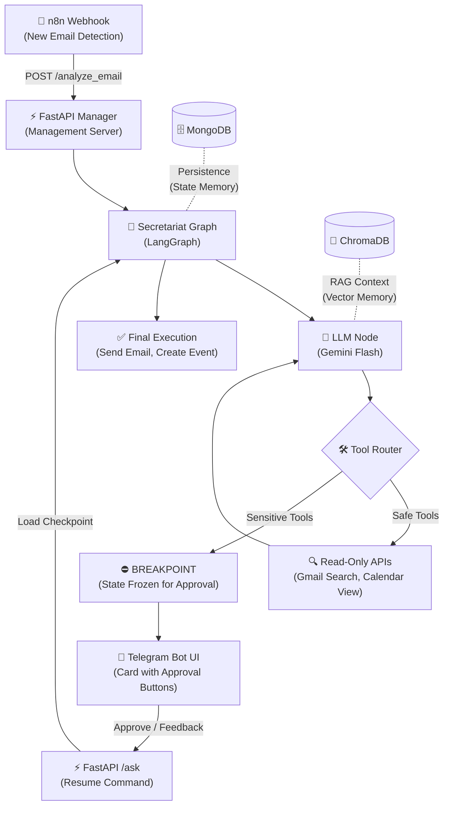

<div align="center">

# 🧠 myOS — Personal Agent Orchestration System

**The Problem:** Manual digital management and context-switching drain cognitive energy.  
**The Solution:** A LangGraph-powered orchestration layer that centralizes Gmail, Calendar, and Telegram into a single intelligent infrastructure, ensuring 100% privacy and human oversight.

[🇮🇱 לקריאה בעברית](README_HE.md)

</div>

---

## � Why I Built This?
I was tired of wasting time manually managing my emails and context-switching between apps just to schedule a meeting. I wanted a digital twin that does the heavy lifting:

*   **Triage:** Identifying what is irrelevant and what is urgent.
*   **Preparation:** Checking the calendar and drafting responses in advance.
*   **Safety:** Nothing is ever executed (sending an email/booking a meeting) without my explicit physical approval via Telegram (Human-in-the-Loop).

---

## 🏗️ End-to-End Architecture
Here is how information flows from the moment an email arrives until an action is executed:



---

## 💡 Key Engineering Pillars

### 1. State Persistence
Using `MongoDBSaver`, the system can "freeze" its execution state. When a user approves an action via Telegram (even hours later), the graph resumes exactly where it left off.

### 2. Human-in-the-Loop (HITL)
A hardcoded "safety brake" is built into the graph topology. Any tool that mutates data in the real world is defined as a Sensitive Tool. The graph automatically freezes before execution, preventing any AI hallucinations.

### 3. Vector Memory (RAG)
Integrating ChromaDB allows the agent to store important information. When asked about past events, the agent retrieves historical facts via vector search before formulating a response.

---

## � Code Snapshot: Graph Definition & Interrupts

```python
# Defining tools that require explicit human approval
sensitive_tool_names = ["create_event", "send_email", "trash_email", "delete_event"]

# Building the graph with a built-in Breakpoint
def build_secretariat_graph(checkpointer):
    return workflow.compile(
        checkpointer=checkpointer, # Persisting state in MongoDB
        interrupt_before=["sensitive_tools"] # Physical stop before sensitive actions
    )
```

---

## 🛠️ Tech Stack
*   **Logic:** LangGraph, Gemini Flash, ChromaDB.
*   **Backend:** FastAPI, Python 3.11.
*   **Database:** MongoDB (Persistence).
*   **Automation:** n8n.
*   **Interface:** Telegram Bot API.
