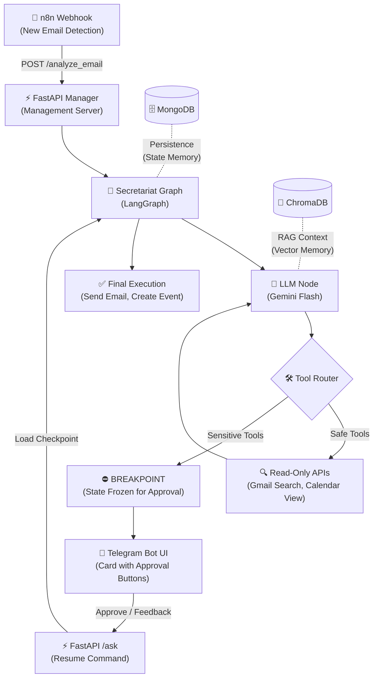

<div align="center">

# 🧠 myOS — Personal Agent Orchestration System


**The Problem:** Manual digital management and context-switching drain cognitive energy.  
**The Solution:** A LangGraph-powered orchestration layer that centralizes Gmail, Calendar, and Telegram into a single intelligent infrastructure, ensuring 100% privacy and human oversight.

[🇮🇱 לקריאה בעברית](README_HE.md)

</div>

---

### 🛠️ My Tech Stack

**Generative AI & Tech:**  
  

**Backend & Database:**  
  

**Automation & Interface:**  
 

**Tools & Environment:**  
 

---

## Safe Contributor Setup
Before changing this repo locally, use the isolated Codex dev box under [`infra/docker-image-codex`](infra/docker-image-codex/README.md). It keeps the repo inside a Docker volume, lets you connect through SSH from VS Code, and avoids exposing runtime secrets inside the working tree.

Use this flow:
1. Copy `infra/docker-image-codex/.env.example` to `infra/docker-image-codex/.env`.
2. Fill in only the required values:
   - `SSH_PUBLIC_KEY` with the contents of your local `id_ed25519.pub`
   - `GITHUB_APP_ID` and `GITHUB_APP_INSTALLATION_ID`
   - `GH_APP_PRIVATE_KEY_FILE` with a PEM path outside the repo
   - `GIT_REPO_URL=https://github.com/GolanLevi/myOS.git`
   - `GIT_REF` with your working branch, not `main`
3. Keep `BOOTSTRAP_GIT_SYNC_MODE=resume` unless you explicitly want startup sync behavior.
4. Start the box from `infra/docker-image-codex`:

```powershell
Set-ExecutionPolicy -Scope Process -ExecutionPolicy Bypass
Unblock-File .\scripts\start.ps1
.\scripts\start.ps1
```

5. Connect with SSH or VS Code Remote-SSH to `dev@127.0.0.1` on port `2222`.
6. Open `/workspace`.
7. Run `codex --login` once inside the container.

Use a feature branch while testing, keep real secret files outside the repository, and commit/push your changes from inside the container so the branch stays the portable source of truth. See the full setup guide in [`infra/docker-image-codex/README.md`](infra/docker-image-codex/README.md).

---

## � Why I Built This?
I was tired of wasting time manually managing my emails and context-switching between apps just to schedule a meeting. I wanted a digital twin that does the heavy lifting:

*   **Triage:** Identifying what is irrelevant and what is urgent.
*   **Preparation:** Checking the calendar and drafting responses in advance.
*   **Safety:** Nothing is ever executed (sending an email/booking a meeting) without my explicit physical approval via Telegram (Human-in-the-Loop).

---

## 🏗️ End-to-End Architecture
Here is how information flows from the moment an email arrives until an action is executed:



---

## 💡 Key Engineering Pillars

### 1. State Persistence
Using `MongoDBSaver`, the system can "freeze" its execution state. When a user approves an action via Telegram (even hours later), the graph resumes exactly where it left off.

### 2. Human-in-the-Loop (HITL)
A hardcoded "safety brake" is built into the graph topology. Any tool that mutates data in the real world is defined as a Sensitive Tool. The graph automatically freezes before execution, preventing any AI hallucinations.

### 3. Vector Memory (RAG)
Integrating ChromaDB allows the agent to store important information. When asked about past events, the agent retrieves historical facts via vector search before formulating a response.

---

## � Code Snapshot: Graph Definition & Interrupts

```python
# Defining tools that require explicit human approval
sensitive_tool_names = ["create_event", "send_email", "trash_email", "delete_event"]

# Building the graph with a built-in Breakpoint
def build_secretariat_graph(checkpointer):
    return workflow.compile(
        checkpointer=checkpointer, # Persisting state in MongoDB
        interrupt_before=["sensitive_tools"] # Physical stop before sensitive actions
    )
```
