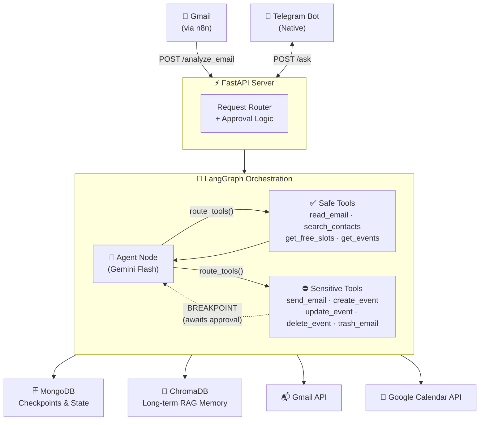
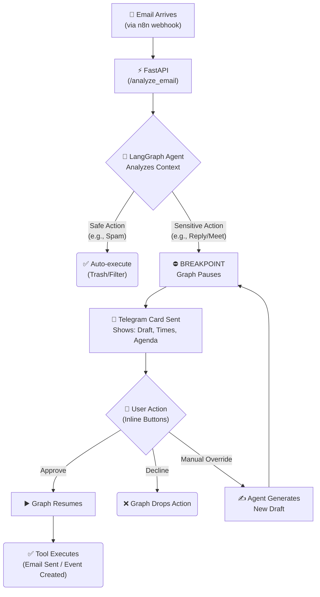

<div align="center">

# 🧠 myOS — AI-Powered Personal Operating System

> A self-hosted AI agent orchestration system that connects your Gmail, Google Calendar, and Telegram into one intelligent, privacy-first workflow.

[🇮🇱 לקריאה בעברית](README_HE.md)

</div>

---

## 📌 What is myOS?

I started building myOS because I was drowning in emails, missing meetings, and constantly context-switching between apps. Instead of looking for another productivity tool, I decided to build one from scratch — one that actually understands context, remembers history, and never does anything sensitive without my explicit approval.

The core principle is simple:
- The AI **analyzes, drafts, and proposes** actions.
- **Sensitive actions pause** and wait for my explicit approval via Telegram.
- All data and credentials stay on **my own machine**.

---

## ✅ What It Currently Does

| Capability | Description |
|---|---|
| 📧 Email Triage | Classifies incoming emails — spam is auto-handled, everything else gets a structured card |
| ✍️ Reply Drafting | Drafts context-aware replies in Hebrew or English before sending anything |
| 📅 Meeting Scheduling | Checks calendar availability, proposes meeting times, and creates events after approval |
| 🔄 Approval Flow | Sends Telegram cards with inline buttons — approve, decline, or provide manual instructions |
| 🧠 Long-term Memory | Stores and retrieves context using vector search (ChromaDB + RAG) |
| 🔒 Human-in-the-Loop | Sensitive tools (send email, create/delete event) are **always gated behind approval** |

---

## 🏗️ Architecture

The system is built around a **LangGraph Stateful Cyclic Graph** — the agent repeatedly reasons, calls tools, and routes back until it either completes a safe action or pauses at a human-approval breakpoint.



### How the HITL Flow Works



---

## 🛠️ Stack

| Layer | Technology |
|---|---|
| **Orchestration** | LangGraph (Stateful Cyclic Graph + Breakpoints) |
| **LLM** | Google Gemini Flash (`gemini-flash-latest`) |
| **API** | FastAPI + Uvicorn |
| **Memory** | ChromaDB (RAG) + MongoDB (LangGraph checkpoints) |
| **Integrations** | Gmail API · Google Calendar API · Telegram Bot API |
| **Ingestion** | n8n (email webhook trigger) |
| **Infrastructure** | Docker Compose |
| **Language** | Python 3.11 |

---

## 🗂️ Project Structure

```
myOS/
├── agents/
│   ├── langgraph_agent.py     # Core LangGraph graph, tool routing, HITL breakpoint
│   ├── information_agent.py   # RAG agent (ChromaDB memory)
│   └── finance_agent.py       # Invoice & payment detection (in progress)
│
├── bot/
│   ├── telegram_bot.py        # Native Telegram bot, inline keyboard handling
│   └── message_formatter.py   # Approval card rendering for Telegram
│
├── core/
│   ├── protocols.py           # ActionProposal schema and safety classification
│   └── state_manager.py       # Contact management, Telegram ID mapping
│
├── utils/
│   ├── gmail_tools_lc.py      # Gmail tools (LangChain ToolNode compatible)
│   ├── calendar_tools_lc.py   # Calendar tools (LangChain ToolNode compatible)
│   └── logger.py              # Structured logging
│
├── server.py                  # FastAPI entry point, approval logic, graph invocation
├── main.py                    # Runs FastAPI + Telegram polling concurrently
├── docker-compose.yml         # Full local stack (FastAPI, MongoDB, ChromaDB, n8n)
└── user_config.json           # Configurable scheduling rules and preferences
```

---

## 🚀 Quick Start

### Prerequisites
- Python 3.11+
- Docker & Docker Compose
- Google Cloud project with Gmail + Calendar APIs enabled
- Telegram Bot token ([@BotFather](https://t.me/BotFather))
- Google Gemini API key

### 1. Clone the Repository
```bash
git clone https://github.com/GolanLevi/myOS.git
cd myOS
```

### 2. Configure Environment
```bash
cp .env.example .env
# Edit .env with your API keys and tokens
```

### 3. Authorize Google Access
```bash
python auth_setup.py
```

### 4. Run with Docker Compose
```bash
docker-compose up
```

### 5. Run Locally (Without Docker)
```bash
pip install -r requirements.txt
python main.py
```

---

## 🔐 Security Notes

- API keys and secrets are stored in local `.env`, `credentials.json`, and `token.json` files — never committed.
- Sensitive actions (send email, create/delete events) require explicit approval before execution.
- Calendar replies expose only availability windows — private event details are never included.
- All graph state is persisted to local MongoDB only.

---

## 🗺️ Roadmap

- [ ] Finance workflow: from invoice detection to review-ready payment summaries
- [ ] Lightweight dashboard for real-time state and memory inspection
- [ ] WhatsApp integration (via WAHA)
- [ ] Improved test coverage for LangGraph routing and tool interception

---

## 📄 License

MIT — see [LICENSE](LICENSE)

---

## 👤 Author

**Golan Levi** — [github.com/GolanLevi](https://github.com/GolanLevi)
