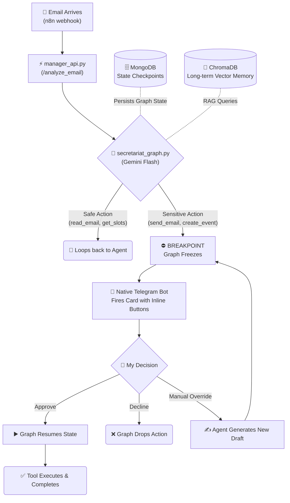

# 🧠 myOS — A Multi-Agent Orchestration System

> **Problem:** Digital fragmentation and constant context-switching consume significant cognitive resources.  
> **Solution:** myOS is a stateful, AI-driven orchestration layer designed to centralize digital workflows. Built on LangGraph, it manages communications (Gmail), scheduling (Calendar), and long-term memory (RAG) through a unified interface, ensuring absolute privacy and human oversight.

[🇮🇱 לקריאה בעברית](README_HE.md)

---

## 📌 The Philosophy: Why "myOS"?

As a developer, I prioritize efficiency. I didn't want another "productivity app" with a fancy dashboard; I wanted a digital infrastructure that understands context. My goal was to build a system that handles the "noise"—summarizing threads, checking availability, and drafting responses—while I retain 100% control over executive actions.

**Key Pillars:**
*   **Cognitive Offloading:** The agent performs all pre-processing (parsing, cross-referencing against the calendar database, and drafting).
*   **Multi-Agent Vision:** Designed as a modular ecosystem where specialized agents (e.g., Information Agent, Finance Agent) operate within the same stateful graph.
*   **Strict HITL (Human-in-the-Loop):** Every "Write" action (sending emails, committing events) is gated by a physical approval via a native Telegram interface.

---

## 🛠️ The Tech Stack

I leverage a broad range of technologies to ensure the system is robust, scalable, and operates locally:

| Layer | Technology |
| :--- | :--- |
| **Logic & AI** | LangGraph (Stateful Cyclic Graphs), Google Gemini Flash, ChromaDB (RAG Vector Store) |
| **Infrastructure** | FastAPI, Docker Compose, MongoDB (LangGraph Checkpointers) |
| **Mobile & UI** | Telegram Bot API, Android Studio & Firebase (for parallel connected apps) |
| **Ingestion** | n8n (Webhook Automation) |
| **Dev Tools** | Python 3.11, **Antigravity**, **Codex** (Pair-programming for complex graph logic) |

---

## 📬 Real-World Logic (Case Studies)

The system doesn't just read emails; it executes complex, multi-step workflows based on the ReAct pattern with support for hardware-level interrupts.

### 1. Context-Aware Scheduling
*The agent identifies a meeting request ⬅️ cross-references real-time availability via the Calendar API ⬅️ generates a localized draft ⬅️ triggers a Telegram Breakpoint ⬅️ executes sync upon approval.*

> ⬇️ **Terminal Logs & Telegram UI:**
> 
> *[Placeholder: Add image `demo_meeting_flow.png` here showing the complete workflow of the AI proposing times and creating an event]*

### 2. Intelligent Triage & High-Priority Alerts
*Using neural classification, the system distinguishes between low-value newsletters (auto-archived/trashed) and critical alerts that bypass the normal queue to ping me directly.*

> ⬇️ **Terminal Logs & Telegram UI:**
> 
> *[Placeholder: Add image `demo_urgent_alert.png` here showing the high-priority alert card and immediate push notification]*

### 3. Long-Term Vector Memory (RAG)
*Queries like "When is my flight?" or "What did we agree on last week?" are resolved by searching ChromaDB, providing the LLM with verified facts instead of hallucinations.*

> ⬇️ **Terminal Logs & Telegram UI:**
> 
> *[Placeholder: Add image `demo_spam.png` here showing the terminal traces deleting marketing junk automatically in the background]*

---

## 🏗️ System Architecture

The core logic resides in a **Stateful Cyclic Graph** (`secretariat_graph.py`). Unlike linear chains, this allows the agent to backtrack, self-correct, call multiple tools iteratively, and maintain state across asynchronous user approvals.

---

## 💡 Design Patterns & Challenges

Building a true AI-native orchestration backend introduced significant engineering challenges:

*   **State Persistence Across Asynchronous Callbacks:** Managing state when a Telegram callback arrives hours after the initial email required implementing a custom `MongoDBSaver` checkpointer for LangGraph. This ensures the graph pauses exactly where it left off without losing the execution thread.
*   **Tool Calling vs. Structured Output:** Balancing raw LLM string generation with strict JSON schema outputs. I bound Native Python tools to the Gemini Flash model, relying on `ToolNode` to catch and parse arguments for the Gmail and Calendar APIs strictly.
*   **AI Pair-Programming Optimization:** To accelerate the integration of the LangGraph state machine, I utilized **Codex** and **Antigravity** as advanced developer tools. This allowed me to rapidly test graph topologies and edge-case tool routing.

---

## 🔐 Privacy & Security

*   **Local-First:** Credentials, `token.json`, and state logs reside entirely on-premises via Docker/Localhost.
*   **Hardcoded Interrupts:** Sensitive tools are physically blocked in the `interrupt_before` array. The model cannot bypass the node execution without a state resume command.
*   **Masked Outputs:** AI drafts are system-prompted to mask sensitive calendar event titles when suggesting slots, ensuring privacy in outbound data.

---

## 🚀 Quick Start (Local Deployment)

1.  **Clone the repository:** `git clone https://github.com/GolanLevi/myOS.git`
2.  **Environment Setup:** Copy `.env.example` to `.env` and populate your Google Workspace / Telegram Bot tokens.
3.  **Authentication:** Run `python auth_setup.py` to generate the initial OAuth tokens.
4.  **Orchestrate:** Spin up the stack using `docker-compose up` (boots MongoDB, ChromaDB, and the FastAPI application).

---

## 📄 License & Contact

This is an open-ended personal project under the MIT License. Built to explore the boundaries of Multi-Agent Systems.

**Golan Levi** 
[github.com/GolanLevi](https://github.com/GolanLevi)
