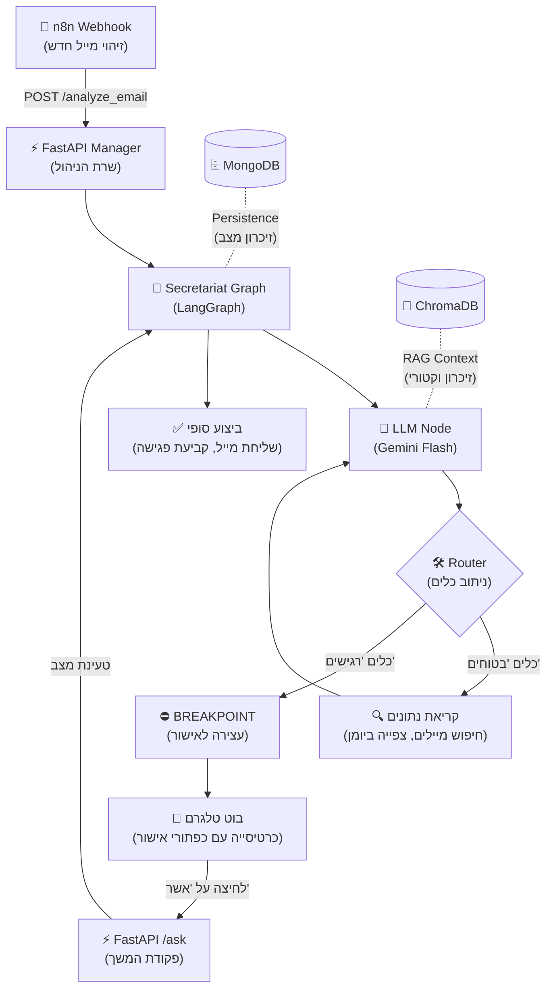
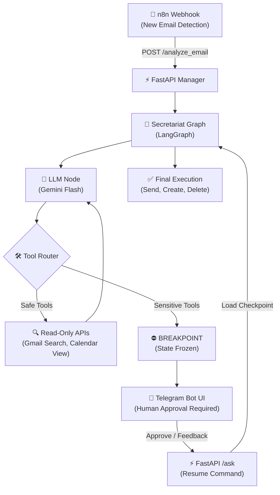

<div align="center">

# 🧠 myOS — Personal Agent Orchestration System

**הבעיה:** ניהול זמן ותכתובות דיגיטליות גוזל משאבים קוגניטיביים יקרים.  
**הפתרון:** שכבת ניהול (Orchestration) מבוססת LangGraph, שמרכזת את כל הפעולות (Gmail, Calendar, Telegram) תחת תשתית אחת חכמה, תוך שמירה על פרטיות מקסימלית ובקרת אנוש.

[🇬🇧 Read in English](#english-version)

</div>

---

## 📌 למה פיתחתי את זה?
נמאס לי לבזבז זמן על ניהול ידני של המיילים שלי ועל קפיצות בין אפליקציות כדי לתאם פגישה. רציתי תאום דיגיטלי שעושה את העבודה השחורה:

*   **סיווג:** מה לא רלוונטי ומה דחוף.
*   **הכנה:** בדיקת היומן וניסוח טיוטה מראש.
*   **בטיחות:** שום דבר לא יוצא לעולם (שליחת מייל/קביעת פגישה) בלי לחיצת כפתור שלי בטלגרם (Human in the loop).

---

## 🏗️ ארכיטקטורת המערכת (End-to-End Flow)
ככה המידע זורם מרגע שמגיע מייל ועד שהפעולה מבוצעת:



---

## 💡 יכולות ליבה הנדסיות

### 1. ניהול מצב (State Persistence)
השתמשתי ב-`MongoDBSaver` כדי שהמערכת תוכל "ללכת לישון" אחרי שהיא שולחת לך הודעה בטלגרם. כשאתה לוחץ על "אשר" (אפילו שעתיים אחרי), המערכת טוענת את המצב המדויק שבו היא עצרה וממשיכה את הביצוע כאילו לא עבר זמן.

### 2. עצירה לאישור אנושי (Human-in-the-Loop)
המערכת מתוכנתת עם "בלם יד" טופולוגי. כל כלי שמשנה מידע בעולם האמיתי מוגדר כ-Sensitive Tool. הגרף קופא אוטומטית לפני הביצוע, מה שמונע טעויות או "הזיות" של ה-AI.

### 3. זיכרון ארוך טווח (RAG)
כל מידע חשוב נשמר ב-ChromaDB. כשאתה שואל שאלה על העבר, הסוכן מבצע חיפוש וקטורי ומקבל את העובדות הרלוונטיות לפני שהוא עונה.

---

## 💻 מבט לקוד: הגדרת הגרף והעצירות

```python
# הגדרת הכלים שדורשים אישור אנושי מפורש
sensitive_tool_names = ["create_event", "send_email", "trash_email", "delete_event"]

# בניית הגרף עם Breakpoint מובנה
def build_secretariat_graph(checkpointer):
    return workflow.compile(
        checkpointer=checkpointer, # שמירת המצב ב-MongoDB
        interrupt_before=["sensitive_tools"] # עצירה פיזית לפני פעולות רגישות
    )
```

---

## 🛠️ Tech Stack
*   **Logic:** LangGraph, Gemini Flash, ChromaDB.
*   **Backend:** FastAPI, Python 3.11.
*   **Database:** MongoDB (Persistence).
*   **Automation:** n8n.
*   **Interface:** Telegram Bot API.

---

<br>
<a name="english-version"></a>

<div align="center">

# 🧠 myOS — Personal Agent Orchestration System (English)

**The Problem:** Manual digital management and context-switching drain cognitive energy.  
**The Solution:** A LangGraph-powered orchestration layer that centralizes Gmail, Calendar, and Telegram into a single intelligent infrastructure, ensuring 100% privacy and human oversight.

</div>

---

## 🏗️ End-to-End Architecture



---

## 💡 Key Engineering Pillars

*   **State Persistence:** Using `MongoDBSaver`, the system can "freeze" its execution state. When a user approves an action via Telegram hours later, the graph resumes exactly where it left off.
*   **Human-in-the-Loop (HITL):** A hardcoded "safety brake" in the graph topology. Any tool that mutates data (sending/deleting) triggers an automatic interrupt, preventing AI hallucinations from affecting the real world.
*   **Vector Memory (RAG):** Integrating ChromaDB allows the agent to retrieve historical facts and context from previous emails and interactions before formulating a response.

---

## 🔐 Privacy & Security
*   **Local-First:** All credentials and state logs reside on-premises via Docker.
*   **Hardcoded Interrupts:** Sensitive tools are physically blocked in the `interrupt_before` array.
*   **Masked Data:** Outbound drafts automatically mask private calendar details.
