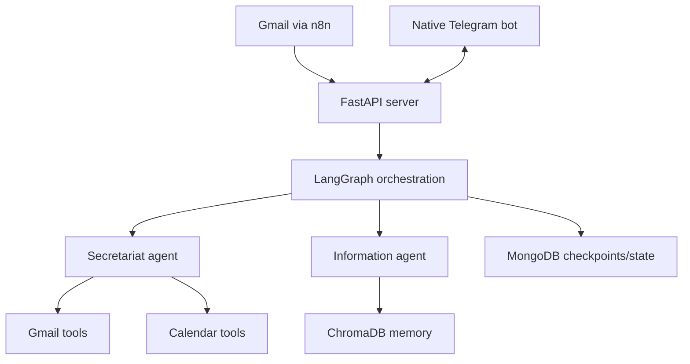

# myOS

Local-first AI operating system for email triage, calendar coordination, memory, and approvals.

[](https://python.org)
[](https://fastapi.tiangolo.com)
[](https://www.langchain.com/langgraph)
[](https://www.docker.com/)
[](LICENSE)

[עברית](README_HE.md)

## Overview

`myOS` is a personal assistant system that connects Gmail, Google Calendar, Telegram, local memory, and AI agents into one workflow.

The project is built around a simple principle:

- AI can analyze, summarize, draft, and suggest.
- Sensitive actions must pause for explicit user approval.
- Data and credentials stay under the owner's control.

Today the system is focused on four core flows:

- Email triage and spam handling
- Meeting scheduling and rescheduling
- Telegram-based approval cards with inline buttons
- Long-term memory using vector search

## Current Status

The current codebase runs a FastAPI server with a LangGraph-based orchestration layer, a native Telegram bot, Google Gmail and Calendar integrations, ChromaDB for memory, and MongoDB for graph checkpoints and state.

`n8n` is currently used as the Gmail ingestion layer. Telegram is handled directly inside the Python app.

## What It Can Do

- Receive incoming email payloads and route them through LangGraph
- Detect spam and low-value messages
- Draft email replies before sending anything
- Check free calendar slots before proposing meeting times
- Create, update, or cancel events behind a human approval gate
- Keep conversational and operational context through MongoDB checkpoints
- Store and retrieve useful long-term notes through ChromaDB
- Send approval requests and summaries to Telegram with native inline buttons

## Demo Assets In This Repo

These are the strongest public-facing examples to keep in the repository:

- [`docs/demo_spam.png`](docs/demo_spam.png): spam email auto-triage example
- [`docs/demo_spam_terminal.png`](docs/demo_spam_terminal.png): server-side processing trace
- [`docs/demo_meeting_flow.png`](docs/demo_meeting_flow.png): end-to-end meeting approval flow in Telegram
- [`docs/n8n_workflow_export.cleaned.json`](docs/n8n_workflow_export.cleaned.json): sanitized n8n workflow example
- [`test_telegram_native_formatter.py`](test_telegram_native_formatter.py): focused test coverage for Telegram approval UX

### Spam Auto-Triage


### Meeting Approval Flow


## Architecture



## Stack

- Python 3.11
- FastAPI + Uvicorn
- LangChain + LangGraph
- Google Gemini / Anthropic / Groq provider support
- Google Gmail API + Google Calendar API
- python-telegram-bot
- ChromaDB
- MongoDB
- n8n
- Docker Compose

## Quick Start

### 1. Clone

```bash
git clone https://github.com/GolanLevi/myOS.git
cd myOS
```

### 2. Create local configuration

- Create `.env` from [`.env.example`](.env.example)
- Review [`user_config.json`](user_config.json) or copy [`user_config.example.json`](user_config.example.json) for your own rules
- Place `credentials.json` in the repository root

Recommended environment variables:

```env
GOOGLE_API_KEY=...
GROQ_API_KEY=...
ANTHROPIC_API_KEY=...
TELEGRAM_BOT_TOKEN=...
TELEGRAM_CHAT_ID=...
NGROK_AUTHTOKEN=...
N8N_WEBHOOK_URL=https://your-public-url.example.com
```

### 3. Authorize Google access

```bash
python auth_setup.py
```

This generates a local `token.json` for Gmail and Calendar access. It is intentionally excluded from Git.

### 4. Run with Docker

```bash
docker compose up --build
```

Services included in the stack:

- `server` - FastAPI + Telegram bot
- `mongo` - state and checkpoint storage
- `chromadb` - vector memory
- `n8n` - Gmail ingestion workflow
- `ngrok` - optional tunnel for local webhook exposure

### 5. Run locally without Docker

```bash
pip install -r requirements.txt
python main.py
```

For local mode, make sure MongoDB and ChromaDB are available.

## API Surface

- `GET /` - health check
- `POST /ask` - chat, approvals, and assistant requests
- `POST /analyze_email` - analyze incoming email payloads
- `POST /memorize` - save text into long-term memory
- `POST /execute` - legacy compatibility endpoint

## Repository Layout

```text
myOS/
|-- agents/                  # LangGraph and domain agents
|-- bot/                     # Native Telegram bot and message formatting
|-- core/                    # Protocols and persistent state handling
|-- docs/                    # Screenshots and supporting documentation
|-- utils/                   # Gmail, Calendar, logging, and tool wrappers
|-- main.py                  # Runs FastAPI and Telegram polling together
|-- server.py                # Main API and orchestration entry point
|-- docker-compose.yml       # Full local stack
|-- user_config.json         # Public sample rule set
|-- user_config.example.json # Additional starter configuration
```

## Security Notes

- Secrets are expected in local files such as `.env`, `credentials.json`, and `token.json`
- Public repo artifacts are sanitized and avoid real tokens, database files, or personal exports
- Sensitive actions are designed to stop behind explicit approval
- Calendar replies should expose availability, not private schedule details

## Roadmap

- Expand the finance workflow from detection into execution-ready review flows
- Add a lightweight dashboard for state, memory, and approvals
- Improve test coverage for LangGraph routing and tool interception
- Add importable demo fixtures for local development

## License

MIT. See [LICENSE](LICENSE).
