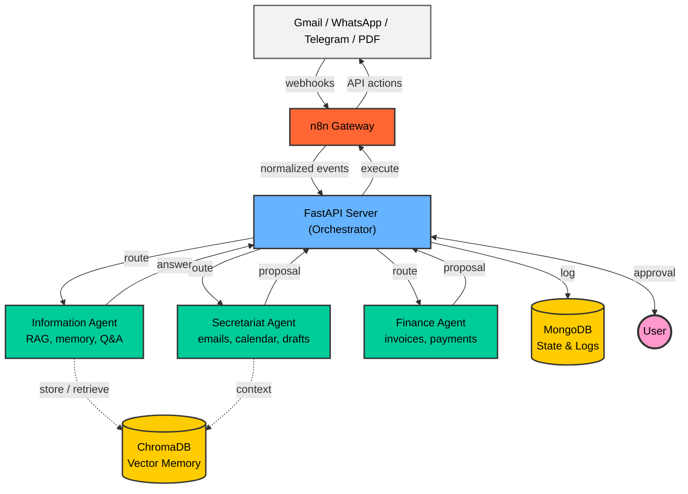

<div align="center">

# 🧠 myOS — AI-Powered Personal Operating System

A personal AI assistant I'm building to help me manage my daily digital life — emails, calendar, finances, and messaging — all from one self-hosted system.

[](https://python.org)
[](https://fastapi.tiangolo.com)
[](https://ai.google.dev)
[](https://docker.com)
[](https://mongodb.com)
[](LICENSE)

[🇮🇱 לקריאה בעברית (Hebrew Version)](README_HE.md)

</div>

---

## 📌 What is myOS?

**myOS** is a project I started to solve a real problem I had: I was drowning in emails, missing meetings, and losing track of tasks spread across Gmail, WhatsApp, and Telegram. Instead of relying on separate apps, I decided to build a system that connects to all of them and handles the routine stuff for me.

The system runs entirely on my machine and uses Google's Gemini AI to understand incoming messages, classify them, draft replies, and manage my calendar. The key idea is **Human-in-the-Loop** — the AI proposes actions, but nothing sensitive happens unless I explicitly approve it.

**What it currently does:**
- 📧 Reads incoming emails and classifies them (spam, meeting requests, tasks)
- 📅 Checks my calendar for conflicts and schedules meetings
- ✍️ Drafts professional replies in both Hebrew and English
- 💰 Detects invoices and payment-related emails *(in progress)*
- 🧠 Stores and retrieves information through a RAG-based long-term memory

---

## 🎬 Demo

### 🗑️ Automatic Spam Detection

When a promotional email like this arrives, the system picks it up, identifies it as spam (based on keywords like "sale", "unsubscribe", "70% off"), and moves it straight to trash automatically. Since the risk level is classified as "safe", no approval is needed.


Here's what the server logs look like while processing it:


### 📅 Meeting Scheduling — Full Approval Flow

This is the flow I'm most proud of. A meeting request email comes in, and the system:
1. Analyzes the email content
2. Checks my Google Calendar for conflicts
3. Drafts a reply
4. Sends me a Telegram message asking if I want to confirm

I reply "כן" (Yes), and the event is created in my calendar automatically.


---

## 🏗️ Architecture

The system is built around a **centralized orchestration** pattern. The general idea is:

- **n8n** listens for external events (new emails, WhatsApp messages) and forwards them to the server
- The **FastAPI server** acts as the brain — it decides which agent should handle the request
- Each **agent** specializes in a different domain (emails, memory, finances)
- The server sends the result back through n8n to notify me, and waits for my approval before executing anything sensitive



### How data flows through the system

1. **Ingestion** — n8n picks up an event (new email, message) and sends it to the FastAPI server
2. **Routing** — The server figures out which agent should handle it
3. **Processing** — The agent analyzes the input and returns a proposal (e.g., "this is spam, delete it" or "this is a meeting request, here's a draft reply")
4. **Notification** — The server sends me a summary on Telegram/WhatsApp and asks what to do
5. **Approval** — I approve or reject
6. **Execution** — If approved, the server tells n8n to carry out the action

### Agents

| Agent | What it does | Status |
|-------|-------------|--------|
| 🗂️ **Secretariat Agent** | Classifies emails, drafts replies, manages the calendar | ✅ Active |
| 📚 **Information Agent** | Stores and retrieves knowledge using RAG (ChromaDB) | ✅ Active |
| 💰 **Finance Agent** | Detects invoices and tracks payments | 🚧 In progress |

---

## 🔐 Security & Privacy

Since this system touches sensitive data (emails, calendar, potentially bank info), I wanted to make sure it's as secure as possible:

- **Self-hosted** — Everything runs on my machine. No data is sent to external servers, except for the Gemini API calls for text processing.
- **Secrets stay local** — API keys and tokens live in `.env` and `token.json`, both excluded from Git.
- **OAuth 2.0** — Google APIs are accessed through standard OAuth with minimal scopes.
- **Nothing happens without approval** — Sensitive actions like sending emails or creating calendar events always require explicit confirmation.
- **Calendar privacy** — When the system drafts replies about availability, it uses generic terms ("busy") instead of sharing actual event names.

---

## 🛠️ Tech Stack

| Technology | What it does | Why I chose it |
|------------|-------------|----------------|
| **Python 3.11** | Core language | Great for AI/ML work, clean syntax, good async support |
| **FastAPI** | API server | Fast, async by default, auto-generates API docs, works well with Pydantic |
| **Google Gemini** | LLM | Handles both text and images, understands Hebrew well, free tier is generous |
| **ChromaDB** | Vector DB for RAG | Runs locally without any setup, lightweight, fits the self-hosted approach |
| **MongoDB** | Data storage | Flexible schema — I can store different types of data (invoices, messages, events) without rigid table structures |
| **n8n** | Workflow automation | Connects to Gmail, WhatsApp, and Telegram visually — saves me from writing a lot of integration code |
| **Docker Compose** | Running everything together | One command brings up all 5 services, makes it easy to set up on any machine |
| **ngrok** | Exposing local server | Needed so WhatsApp and Telegram can send webhooks to my local machine |

---

## 🚀 Getting Started

### Prerequisites

- **Python 3.11+**
- **Docker & Docker Compose**
- **Google Account** with Gmail API & Calendar API enabled
- **Google Gemini API Key**

### 1. Clone the Repository

```bash
git clone https://github.com/GolanLevi/myOS.git
cd myOS
```

### 2. Set Up Environment Variables

Create a `.env` file in the root directory:

```env
GOOGLE_API_KEY=your_gemini_api_key_here
NGROK_AUTHTOKEN=your_ngrok_token_here
```

### 3. Set Up Google OAuth

1. Create a project in [Google Cloud Console](https://console.cloud.google.com/)
2. Enable **Gmail API** and **Calendar API**
3. Create OAuth 2.0 Credentials and download `credentials.json` to the root directory
4. Run the authentication script:

```bash
python auth_setup.py
```

> This generates a `token.json` for automatic Gmail & Calendar access.

### 4. Run with Docker Compose

```bash
docker-compose up --build
```

This starts all the services:

| Service | Port | Description |
|---------|------|-------------|
| **myOS Server** | `8080` | Main FastAPI server |
| **MongoDB** | `27017` | State & logs database |
| **ChromaDB** | `8001` | Vector DB for RAG |
| **n8n** | `5678` | Automation workflows |
| **ngrok** | `4040` | Tunnel dashboard |

### 5. Run Locally (Without Docker)

```bash
pip install -r requirements.txt
uvicorn server:app --host 0.0.0.0 --port 8000 --reload
```

> ⚠️ When running locally, MongoDB and ChromaDB need to be running separately.

---

## 📡 API Endpoints

| Endpoint | Method | Description |
|----------|--------|-------------|
| `/` | GET | Health check |
| `/analyze_email` | POST | Analyze an incoming email (classify, draft, schedule) |
| `/ask` | POST | Chat — ask questions or approve pending actions |
| `/memorize` | POST | Save information to long-term memory |
| `/execute` | POST | Execute an action directly |
| `/webhook/whatsapp` | POST | Receive responses from WhatsApp |
| `/register_message_map` | POST | Map internal IDs to Telegram message IDs |

### Example — Analyze an Email

```bash
curl -X POST http://localhost:8080/analyze_email \
  -H "Content-Type: application/json" \
  -d '{
    "text": "Subject: Meeting Request\nHi, can we meet next Tuesday at 10am?",
    "source": "gmail",
    "email_id": "msg_123"
  }'
```

---

## 📁 Project Structure

```
myOS/
├── server.py                 # Main server — routes requests and manages approvals
├── agents/
│   ├── secretariat_agent.py  # Email classification, calendar, drafting
│   ├── information_agent.py  # RAG memory and knowledge retrieval
│   └── finance_agent.py      # Invoice and payment detection
├── core/
│   ├── protocols.py          # Shared data models and protocols
│   └── state_manager.py      # Manages state and the approval flow
├── utils/
│   ├── gmail_tools.py        # Gmail API wrapper functions
│   ├── gmail_connector.py    # Gmail OAuth connection
│   └── calendar_tools.py     # Google Calendar API functions
├── docs/
│   ├── architecture.md       # Architecture documentation
│   └── project_summary.md    # Technical summary of the project
├── docker-compose.yml        # Docker services configuration
├── Dockerfile                # Server container definition
├── requirements.txt          # Python dependencies
├── user_config.json          # Custom classification rules
├── auth_setup.py             # Google OAuth setup script
└── .env                      # Environment variables (not in Git)
```

---

## ⚙️ Configuration

Classification rules are defined in `user_config.json`. For example, I set up rules to automatically trash job rejection emails and flag interview invitations:

```json
{
  "user_name": "Golan",
  "rules": [
    {
      "topic": "Spam & Newsletters",
      "keywords": ["unsubscribe", "sale", "newsletter"],
      "action": "trash",
      "risk": "safe"
    },
    {
      "topic": "Job Interview / Progress",
      "keywords": ["interview", "schedule a call", "next steps"],
      "action": "notify_user",
      "risk": "safe"
    }
  ]
}
```

---

## 🗺️ Roadmap

**Done:**
- [x] Secretariat Agent — email classification, drafting, calendar management
- [x] Information Agent — RAG with ChromaDB for long-term memory
- [x] Human-in-the-Loop approval flow via WhatsApp/Telegram
- [x] Docker Compose setup with all services
- [x] Contact management — automatic saving and retrieval

**Next up:**
- [ ] Finance Agent — full integration with the server
- [ ] Unified Ledger — centralized payment tracking
- [ ] Web dashboard for managing the system
- [ ] Bank API integration
- [ ] Additional agents (LinkedIn, Slack)
- [ ] Proactive notifications

---

## 🤝 Contributing

This project is in early development. If you'd like to contribute or have ideas, feel free to open an issue or submit a PR.

1. Fork the repo
2. Create your branch (`git checkout -b feature/your-feature`)
3. Commit your changes (`git commit -m 'Add your feature'`)
4. Push to the branch (`git push origin feature/your-feature`)
5. Open a Pull Request

---

## 📄 License

This project is licensed under the MIT License — see the [LICENSE](LICENSE) file for details.

---

<div align="center">

**Built with ❤️ and AI**

</div>
