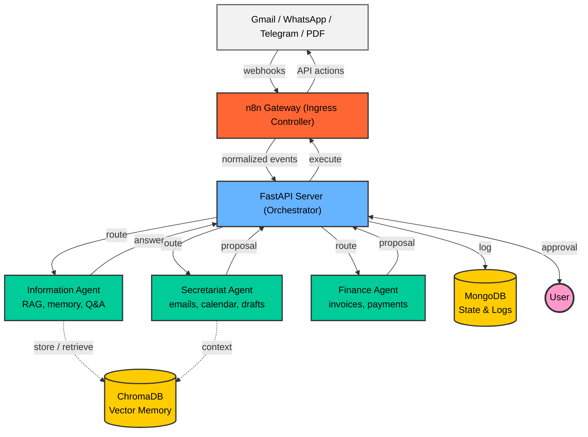

<div align="center">

# 🧠 myOS — AI-Powered Personal Operating System

**A self-hosted AI assistant that manages your emails, calendar, finances, and communications — while keeping you in full control.**

[](https://python.org)
[](https://fastapi.tiangolo.com)
[](https://ai.google.dev)
[](https://docker.com)
[](https://mongodb.com)
[](LICENSE)

[🇮🇱 לקריאה בעברית (Hebrew Version)](README_HE.md)

</div>

---

## 📌 What is myOS?

**myOS** is a personal AI system that runs locally on your machine and acts as your "personal operating system". It connects to Gmail, Google Calendar, WhatsApp, and Telegram to:

- 📧 **Analyze incoming emails** — classify spam, meeting requests, and active tasks automatically
- 📅 **Manage your calendar** — check availability, suggest time slots, and schedule meetings
- ✍️ **Draft responses** — write professional replies in Hebrew and English
- 💰 **Detect invoices & payments** — extract amounts and due dates from PDFs and emails
- 🧠 **Remember everything** — RAG-based long-term memory that retrieves context on demand

> **🔒 Core Principle: Human-in-the-Loop** — No sensitive action is ever executed without your explicit approval.

---

## 🎬 Demo

### 🗑️ Automatic Spam Detection

A promotional email arrives in Gmail. myOS identifies keywords like "sale", "unsubscribe", and "70% off", classifies it as spam, and automatically moves it to trash — no user approval needed since the risk level is "safe".


**Server log** — the AI decision pipeline in real-time:


### 📅 Meeting Scheduling — Full Approval Flow

A meeting request email arrives. myOS analyzes the content, checks the calendar for availability, drafts a professional reply, and sends an approval request via Telegram. The user replies "כן" (Yes) and the event is created in Google Calendar automatically.


---

## 🏗️ Architecture

The system follows an **Event-Driven Centralized Orchestration** pattern with **Human-in-the-Loop** approval. n8n acts as an **Ingress Controller**, capturing webhooks and incoming events (new emails, WhatsApp messages) and pushing them into the FastAPI server. The server processes, routes to specialized agents, and responds back through n8n for execution.



### Data Flow

1. **Ingestion** — n8n captures webhooks from external services and pushes normalized events to the FastAPI server via HTTP POST
2. **Routing** — The server routes the request to the appropriate specialized agent for analysis
3. **Processing** — The agent analyzes the input and returns a proposal (draft reply, calendar event, classification)
4. **Notification** — The server sends a human-readable summary back through n8n to WhatsApp/Telegram, requesting user approval
5. **Approval** — User approves or rejects; n8n forwards the decision back to the server
6. **Execution** — Upon approval, the server instructs n8n to execute the action (send email, create event, etc.)

### Agents

| Agent | Role | Status |
|-------|------|--------|
| 🗂️ **Secretariat Agent** | Email classification, draft responses, calendar management | ✅ Active |
| 📚 **Information Agent** | RAG-based memory, long-term knowledge, Q&A | ✅ Active |
| 💰 **Finance Agent** | Invoice detection, payment tracking | 🚧 In Development |

---

## 🔐 Security & Privacy

myOS is designed with privacy as a first-class concern:

- **100% Self-Hosted** — The entire system runs locally on your machine (or your own Docker environment). No data is sent to third-party servers beyond the AI model API calls.
- **Secrets Management** — All API keys and tokens are stored in `.env` and `token.json`, both excluded from version control via `.gitignore`.
- **OAuth 2.0** — Google API access uses standard OAuth 2.0 with scoped permissions — only the minimum required access is requested.
- **Human-in-the-Loop** — Every sensitive action (sending emails, scheduling events, payments) requires explicit user approval before execution.
- **Privacy in Drafts** — Calendar-related drafts use generic terms ("occupied") instead of exposing specific event details.

---

## 🛠️ Tech Stack

| Technology | Purpose | Why? |
|------------|---------|------|
| **Python 3.11** | Core language | Clean syntax, rich AI/ML ecosystem, native async support |
| **FastAPI** | Web framework | High performance with native async, auto-generated OpenAPI docs, type safety via Pydantic |
| **Google Gemini** | AI model | Multimodal capabilities (text + vision), strong Hebrew language support, generous API limits |
| **ChromaDB** | Vector database | Lightweight embedded vector DB — perfect for local RAG without external infrastructure |
| **MongoDB** | Document store | Schema-less flexibility for diverse data structures (invoices vs. messages vs. calendar events) |
| **n8n** | Automation engine | Visual workflow builder for connecting Gmail, WhatsApp, Telegram — no custom integration code needed |
| **Docker Compose** | Containerization | One command to spin up all 5 services with consistent, reproducible environments |
| **ngrok** | Tunneling | Exposes local server for webhook callbacks from WhatsApp and Telegram |

---

## 🚀 Quick Start

### Prerequisites

- **Python 3.11+**
- **Docker & Docker Compose**
- **Google Account** with Gmail API & Calendar API enabled
- **Google Gemini API Key**

### 1. Clone the Repository

```bash
git clone https://github.com/GolanLevi/myOS.git
cd myOS
```

### 2. Set Up Environment Variables

Create a `.env` file in the root directory:

```env
GOOGLE_API_KEY=your_gemini_api_key_here
NGROK_AUTHTOKEN=your_ngrok_token_here
```

### 3. Set Up Google OAuth

1. Create a project in [Google Cloud Console](https://console.cloud.google.com/)
2. Enable **Gmail API** and **Calendar API**
3. Create OAuth 2.0 Credentials and download `credentials.json` to the root directory
4. Run the authentication script:

```bash
python auth_setup.py
```

> This generates a `token.json` for automatic Gmail & Calendar access.

### 4. Run with Docker Compose

```bash
docker-compose up --build
```

This spins up all services:

| Service | Port | Description |
|---------|------|-------------|
| **myOS Server** | `8080` | Main FastAPI server |
| **MongoDB** | `27017` | State & logs database |
| **ChromaDB** | `8001` | Vector DB for RAG memory |
| **n8n** | `5678` | Automation workflows |
| **ngrok** | `4040` | Tunnel dashboard |

### 5. Run Locally (Without Docker)

```bash
pip install -r requirements.txt
uvicorn server:app --host 0.0.0.0 --port 8000 --reload
```

> ⚠️ When running locally, make sure MongoDB and ChromaDB are running separately.

---

## 📡 API Endpoints

| Endpoint | Method | Description |
|----------|--------|-------------|
| `/` | GET | Health check — "myOS is alive!" |
| `/analyze_email` | POST | Analyze incoming email (classify, draft, schedule) |
| `/ask` | POST | Smart chat with approval management |
| `/memorize` | POST | Store information in long-term memory (RAG) |
| `/execute` | POST | Direct action execution |
| `/webhook/whatsapp` | POST | Receive WhatsApp responses |
| `/register_message_map` | POST | Register Telegram message ID mapping |

### Example — Analyze an Email

```bash
curl -X POST http://localhost:8080/analyze_email \
  -H "Content-Type: application/json" \
  -d '{
    "text": "Subject: Meeting Request\nHi, can we meet next Tuesday at 10am?",
    "source": "gmail",
    "email_id": "msg_123"
  }'
```

---

## 📁 Project Structure

```
myOS/
├── server.py                 # 🧠 FastAPI server — the brain of the system
├── agents/
│   ├── secretariat_agent.py  # 📧 Email classification, calendar, drafts
│   ├── information_agent.py  # 📚 RAG memory, knowledge retrieval
│   └── finance_agent.py      # 💰 Invoice detection, payment tracking
├── core/
│   ├── protocols.py          # 📜 Shared protocols & data models
│   └── state_manager.py      # 🔄 State management & approval flow (HITL)
├── utils/
│   ├── gmail_tools.py        # ✉️ Gmail API functions
│   ├── gmail_connector.py    # 🔌 Gmail OAuth connection
│   └── calendar_tools.py     # 📅 Google Calendar API functions
├── docs/
│   ├── architecture.md       # 🏗️ Full architecture documentation
│   └── project_summary.md    # 📋 Technical project summary
├── docker-compose.yml        # 🐳 All services configuration
├── Dockerfile                # 📦 Server container build
├── requirements.txt          # 📦 Python dependencies
├── user_config.json          # ⚙️ Custom classification rules
├── auth_setup.py             # 🔑 Google OAuth setup script
└── .env                      # 🔒 Environment variables (not in Git)
```

---

## 🔄 Use Cases

### 📧 Incoming Email Analysis
```
New email → n8n webhook → /analyze_email → Classification (spam/meeting/task)
  → Draft response / Calendar event → Notify user → Approval → Execute
```

### 💬 Smart Question (RAG)
```
"How much did we pay the electric company?" → /ask → Memory search → Summarized answer
```

### ✅ Action Approval
```
"Yes" on WhatsApp → /webhook/whatsapp → Execute pending action → ✅ Done
```

---

## ⚙️ Configuration

The `user_config.json` file allows defining custom classification rules:

```json
{
  "user_name": "Golan",
  "rules": [
    {
      "topic": "Spam & Newsletters",
      "keywords": ["unsubscribe", "sale", "newsletter"],
      "action": "trash",
      "risk": "safe"
    },
    {
      "topic": "Job Interview / Progress",
      "keywords": ["interview", "schedule a call", "next steps"],
      "action": "notify_user",
      "risk": "safe"
    }
  ]
}
```

---

## 🗺️ Roadmap

- [x] Secretariat Agent — email classification, drafts, calendar management
- [x] Information Agent — RAG with ChromaDB, long-term memory
- [x] Human-in-the-Loop — approvals via WhatsApp/Telegram
- [x] Docker Compose — full deployment with all services
- [x] Contact management — automatic save & retrieval
- [ ] Finance Agent — full integration with server.py
- [ ] Unified Ledger — centralized payment tracking
- [ ] User Dashboard — web-based management UI
- [ ] Bank API integration
- [ ] Additional agents (LinkedIn, Slack)
- [ ] Proactive smart notifications

---

## 🤝 Contributing

This project is in early development. Contributions are welcome!

1. Fork the repo
2. Create your branch (`git checkout -b feature/amazing-feature`)
3. Commit your changes (`git commit -m 'Add amazing feature'`)
4. Push to the branch (`git push origin feature/amazing-feature`)
5. Open a Pull Request

---

## � License

This project is licensed under the MIT License — see the [LICENSE](LICENSE) file for details.

---

<div align="center">

**Built with ❤️ and AI**

*myOS — Because your life deserves an operating system.*

</div>
