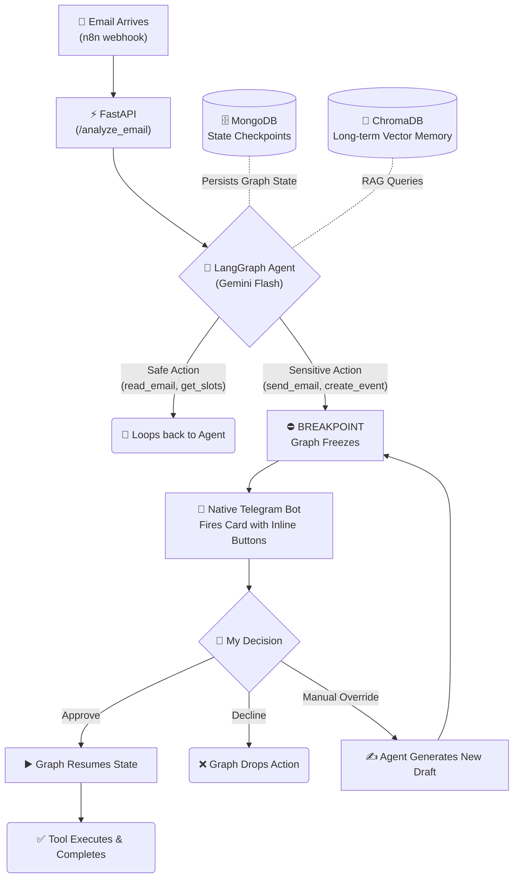

<div align="center">

# 🧠 myOS — My Personal AI Operating System

> I was drowning in emails and context-switching, so I built a self-hosted, LangGraph-powered AI agent to orchestrate my digital life (Gmail, Calendar, Telegram) — with extreme privacy and a strict Human-in-the-Loop design.

[🇮🇱 לקריאה בעברית](README_HE.md)

</div>

---

## 📌 Why I Built This

Hi! 👋 I'm a passionate junior developer obsessed with Generative AI and building real-world software. I started building **myOS** because I was tired of generic "productivity apps." I didn't want another dashboard — I wanted a *digital twin*. Someone (or something) that understands my context, remembers my history, checks my calendar before I even ask, but **never does anything sensitive without my explicit permission.**

The core philosophy of this project is simple:
- The AI does the heavy lifting: **analyzing, drafting, and proposing.**
- **Sensitive actions** (like sending an email or booking a calendar event) pause and wait for my approval via a native Telegram bot.
- All data, credentials, and states live locally on my machine. No third-party wrappers, just raw APIs and intelligent agents.

---

## 🛠️ The Craftsmanship: How It Was Built

Building a system like this is complex. Transitioning from a linear script to a **Stateful Cyclic Graph** required a lot of trial and error. To move fast and learn deeply, I actively collaborated with advanced AI coding assistants — specifically **Codex** and **Antigravity**. 

Using these tools as pair-programmers allowed me to rapidly prototype the LangGraph architecture, refine the custom tool bindings (so Gemini knows exactly what Gmail functions it can use), and debug nasty infinite loops in the agent's logic. It was an incredible journey of learning how to orchestrate AI *using* AI.

---

## 📬 The Journey of an Email (3 Real Scenarios)

To really understand what this system does, here is exactly what happens when different types of emails hit the server via the n8n webhook:

### Scenario 1: The Magic of Scheduling (Meeting Request)
*Someone wants to meet with me next week.*
1. **Context Extraction:** The LangGraph agent reads the email and understands the intent.
2. **Tool Execution (Safe):** The agent autonomously calls the `get_free_slots` tool to check my actual Google Calendar against the requested time.
3. **Drafting:** The agent writes a polite response in the sender's language, offering the available times.
4. **The Breakpoint (HITL):** Since sending an email is a "sensitive tool," the graph *freezes*. It fires a beautiful summary card to my Telegram.
5. **Approval:** I tap the "Approve & Sync" inline button in Telegram.
6. **Execution:** The graph resumes, fires the `send_email` and `create_event` tools, and boom — it's in my calendar.

> ⬇️ **Demo: The typical meeting approval flow**
> 
> *[Placeholder: Add image `demo_meeting_flow.png` here showing the Telegram bot interface proposing times and the final calendar sync]*

### Scenario 2: Emergency Alert! (High Priority)
*An urgent alert from a monitoring system or a critical update from a boss.*
1. **Classification:** The agent scans the incoming email and its neural network flags the urgency markers ("Urgent", "Action Required").
2. **Bypassing the Queue:** The agent realizes this isn't something to just draft and wait on.
3. **Immediate Ping:** It immediately routes a high-priority alert directly to my Telegram with a concise summary of the crisis, so I know exactly what needs my attention without opening the Gmail app.

> ⬇️ **Demo: Handling an urgent alert**
> 
> *[Placeholder: Add image `demo_urgent_alert.png` here showing a red/urgent Telegram card]*

### Scenario 3: The Silent Guardian (Spam & Marketing)
*A random marketing newsletter or cold sales outreach.*
1. **Classification:** The agent reads the email, spots the marketing language, and classifies it as low-value/spam.
2. **Silent Execution:** Because moving to trash is considered an auto-executable "safe" action for marketing emails, the agent calls the `trash_email` tool immediately.
3. **No Distraction:** The graph ends. I never get a notification. My phone never buzzes. Pure focus.

> ⬇️ **Demo: Taming the spam folder**
> 
> *[Placeholder: Add image `demo_spam.png` here showing the terminal logs of an email being identified and trashed without human intervention]*

---

## 🏗️ Architecture Under the Hood

The brain of the operation lives in `secretariat_graph.py` and is served by `manager_api.py`. It uses a **LangGraph Stateful Cyclic Graph** — meaning the agent repeatedly reasons, calls tools, and routes back to itself until it reaches a conclusion or a predefined breakpoint.



### The Stack I Used

| Layer | Technology |
|---|---|
| **Orchestration** | LangGraph (Stateful Cyclic Graphs & Breakpoints) |
| **LLM** | Google Gemini SDK (`gemini-flash-latest`) |
| **Backend API** | FastAPI + Uvicorn |
| **Databases** | ChromaDB (RAG Memory) + MongoDB (Graph Checkpointers) |
| **Integrations** | Google Workspace APIs (Gmail, Calendar) · Telegram Bot API |
| **Ingestion** | n8n (Webhook trigger layer) |
| **Language & Env** | Python 3.11 · Docker Compose |

---

## 🗂️ Project Structure

```text
myOS/
├── agents/
│   ├── secretariat_graph.py   # The core LangGraph state machine & HITL logic
│   ├── information_agent.py   # RAG agent attached to ChromaDB
│   └── finance_agent.py       # Invoice parsing (in progress)
│
├── bot/
│   ├── telegram_bot.py        # Native Telegram integration and keyboard rendering
│   └── message_formatter.py   # Beautiful layout generator for approval cards
│
├── utils/
│   ├── gmail_tools_lc.py      # LangChain-compatible tools for Gmail API
│   ├── calendar_tools_lc.py   # LangChain-compatible tools for Google Calendar
│   └── logger.py              # Structured and colored terminal logging
│
├── manager_api.py             # Main FastAPI server and route controllers
├── main.py                    # Thread runner for API + Telegram Polling
└── docker-compose.yml         # Container orchestration (FastAPI, Mongo, Chroma)
```

---

## 🚀 Quick Start

If you're brave enough to run your own OS:

### 1. Prerequisites
- Python 3.11+
- Docker & Docker Compose
- Google Cloud project (Gmail + Calendar APIs enabled)
- Telegram Bot token (`@BotFather`)

### 2. Setup
```bash
git clone https://github.com/GolanLevi/myOS.git
cd myOS
cp .env.example .env # And inject your API keys here
```

### 3. Google Auth
```bash
python auth_setup.py # Follow the browser prompt to generate token.json
```

### 4. Run the Engine
```bash
docker-compose up
```

---

## 🔐 Privacy & Security Built-in

I built this for my own life, so security was paramount:
- **No Remote Storage:** Keys, `.env`, and `token.json` never leave the machine. MongoDB runs locally.
- **Fail-Safe Approvals:** Every tool that mutates data (sending, deleting, creating) is hardcoded into a LangGraph `interrupt_before` array. The AI *cannot* act without physical button presses.
- **Calendar Masking:** When drafting emails, the AI is prompted to expose only raw availability slots, carefully masking private event names.

---

## 📄 License & Contact

This is an open-ended personal project under the MIT License. Feel free to fork it, break it, and build your own digital twin.

**Golan Levi** 
[github.com/GolanLevi](https://github.com/GolanLevi)
