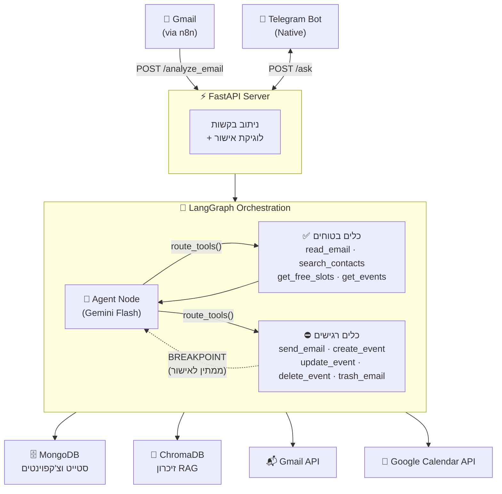

<div align="center">

# 🧠 myOS — מערכת הפעלה אישית מבוססת AI

> מערכת לתזמור סוכני AI עצמאית (self-hosted) שמחברת את Gmail, Google Calendar וטלגרם לזרימת עבודה אחת וחכמה, עם שמירה על פרטיות מלאה.

[🇬🇧 Read in English](README.md)

</div>

---

## 📌 מה זה myOS?

התחלתי לבנות את myOS כי טבעתי במיילים, פספסתי פגישות, וקפצתי כל הזמן בין אפליקציות שונות. במקום לחפש עוד כלי פרודוקטיביות, החלטתי לבנות אחד בעצמי — כזה שמבין הקשר, זוכר היסטוריה, ולא עושה שום דבר רגיש בלי האישור המפורש שלי.

העיקרון הוא פשוט:
- ה-AI **מנתח, מנסח ומציע** פעולות.
- **פעולות רגישות** עוצרות ומחכות לאישור מפורש שלי דרך טלגרם.
- כל המידע והמפתחות נשארים **על המחשב שלי**.

---

## ✅ מה המערכת יודעת לעשות כיום

| יכולת | תיאור |
|---|---|
| 📧 סיווג מיילים | מסווגת מיילים נכנסים — ספאם מטופל אוטומטית, כל השאר מקבל כרטיס מסודר |
| ✍️ ניסוח תשובות | מנסחת תשובות מותאמות הקשר בעברית או אנגלית לפני ששולחת כלום |
| 📅 תיאום פגישות | בודקת זמינות ביומן, מציעה שעות, ויוצרת אירועים אחרי אישור |
| 🔄 תהליך אישור | שולחת כרטיסים לטלגרם עם כפתורים — אשר, דחה, או תן הכוונה ידנית |
| 🧠 זיכרון ארוך-טווח | שומרת ומאחזרת הקשר בעזרת חיפוש וקטורי (ChromaDB + RAG) |
| 🔒 Human-in-the-Loop | כלים רגישים (שליחת מייל, יצירת/מחיקת אירוע) **תמיד עוצרים לאישור** |

---

## 🏗️ ארכיטקטורה

המערכת בנויה סביב **LangGraph Stateful Cyclic Graph** — הסוכן חושב, מפעיל כלים ומנתב בחזרה שוב ושוב, עד שהוא מסיים פעולה בטוחה או עוצר בנקודת אישור.



### איך תהליך ה-HITL עובד

```
מייל נכנס (דרך n8n)
        │
        ▼
FastAPI /analyze_email
        │
        ▼
סוכן LangGraph מנתח ────► פעולה בטוחה (לדוגמה, ספאם)?
        │                               │
        │                               ▼
        │                         מבצע אוטומטית ✅
        │
        ▼
נדרשת פעולה רגישה (שליחת תשובה, יצירת אירוע)?
        │
        ▼
⛔ BREAKPOINT — הגרף מושהה
        │
        ▼
כרטיס טלגרם נשלח למשתמש עם:
  📋 תוכן הטיוטה
  ⏰ מועד מוצע
  📆 לוז יומי לאותו תאריך
  [[BUTTONS: אשר | דחה | אני אגיב ידנית]]
        │
        ▼
המשתמש לוחץ "אשר" ──► הגרף ממשיך ──► הכלי מופעל ──► ✅ סיום
```

---

## 🛠️ טכנולוגיות

| שכבה | טכנולוגיה |
|---|---|
| **אורקסטרציה** | LangGraph (Stateful Cyclic Graph + Breakpoints) |
| **LLM** | Google Gemini Flash (`gemini-flash-latest`) |
| **API** | FastAPI + Uvicorn |
| **זיכרון** | ChromaDB (RAG) + MongoDB (LangGraph checkpoints) |
| **אינטגרציות** | Gmail API · Google Calendar API · Telegram Bot API |
| **קבלת מיילים** | n8n (webhook trigger) |
| **תשתית** | Docker Compose |
| **שפה** | Python 3.11 |

---

## 🗂️ מבנה הפרויקט

```
myOS/
├── agents/
│   ├── langgraph_agent.py     # גרף LangGraph המרכזי, ניתוב כלים, נקודת HITL
│   ├── information_agent.py   # סוכן RAG (זיכרון ChromaDB)
│   └── finance_agent.py       # זיהוי חשבוניות ותשלומים (בפיתוח)
│
├── bot/
│   ├── telegram_bot.py        # בוט טלגרם נייטיב, ניהול כפתורים
│   └── message_formatter.py   # עיצוב כרטיסי אישור לטלגרם
│
├── core/
│   ├── protocols.py           # סכמת ActionProposal וסיווג בטיחות
│   └── state_manager.py       # ניהול אנשי קשר ומיפוי מזהי טלגרם
│
├── utils/
│   ├── gmail_tools_lc.py      # כלי Gmail (תואם LangChain ToolNode)
│   ├── calendar_tools_lc.py   # כלי Calendar (תואם LangChain ToolNode)
│   └── logger.py              # לוגים מסודרים
│
├── server.py                  # נקודת כניסה FastAPI, לוגיקת אישור, הפעלת הגרף
├── main.py                    # מריץ FastAPI + polling טלגרם במקביל
├── docker-compose.yml         # סביבה מלאה (FastAPI, MongoDB, ChromaDB, n8n)
└── user_config.json           # חוקי תזמון ועדפות הניתנים לשינוי
```

---

## 🚀 התחלה מהירה

### דרישות מוקדמות
- Python 3.11+
- Docker & Docker Compose
- פרויקט Google Cloud עם Gmail + Calendar APIs מופעלים
- מפתח Telegram Bot ([@BotFather](https://t.me/BotFather))
- מפתח Google Gemini API

### 1. שכפול המאגר
```bash
git clone https://github.com/GolanLevi/myOS.git
cd myOS
```

### 2. הגדרת משתני סביבה
```bash
cp .env.example .env
# ערוך את .env עם מפתחות ה-API שלך
```

### 3. הרשאת גישה ל-Google
```bash
python auth_setup.py
```

### 4. הרצה עם Docker Compose
```bash
docker-compose up
```

### 5. הרצה ללא Docker
```bash
pip install -r requirements.txt
python main.py
```

---

## 🔐 אבטחה ופרטיות

- כל המפתחות והסיסמאות שמורים בקבצים מקומיים (`.env`, `credentials.json`) — לא מועלים ל-Git.
- פעולות רגישות (שליחת מייל, יצירת/מחיקת אירועים) דורשות אישור מפורש לפני ביצוע.
- תשובות תיאום פגישות חושפות רק חלונות זמינות — פרטי אירועים פרטיים לא נחשפים.
- כל סטייט הגרף נשמר רק ב-MongoDB מקומי.

---

## 🗺️ Roadmap

- [ ] זרימת כספים: מזיהוי חשבוניות לתקצירי תשלום מוכנים לאישור
- [ ] דשבורד קל-משקל לניטור סטייט וזיכרון בזמן אמת
- [ ] אינטגרציה עם WhatsApp (via WAHA)
- [ ] הרחבת כיסוי בדיקות ל-routing ב-LangGraph

---

## 📄 רישיון

MIT — ראה [LICENSE](LICENSE)

---

## 👤 מפתח

**גולן לוי** — [github.com/GolanLevi](https://github.com/GolanLevi)
