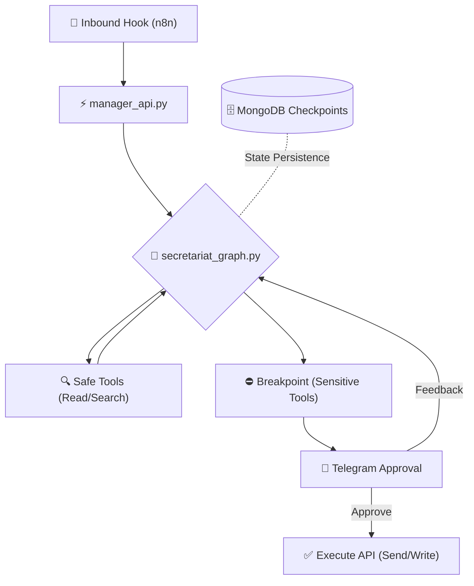

# 🧠 myOS — Personal Agent Orchestration System

> **הבעיה:** ניהול זמן ותכתובות דיגיטליות גוזל משאבים קוגניטיביים יקרים עקב קפיצות תכופות בין הקשרים (Context-Switching).  
> **הפתרון:** שכבת ניהול (Orchestration) מבוססת AI, שנועדה לרכז את כל התפעול הדיגיטלי תחת תשתית חכמה אחת. myOS מנהלת מצב (Statefulness), שולפת מידע מזיכרון וקטורי (RAG), ומתוזמרת כרשת סוכנים המנהלת לוגיקה של תקשורת ויומנים תוך שמירה מלאה על פרטיות ובקרת אנוש.

[🇬🇧 Read in English](README.md)

---

## 📌 הפילוסופיה: למה "myOS"?

בתור מפתח, אני מחפש יעילות טכנולוגית מקסימלית. לא רציתי עוד "אפליקציית משימות" גנרית; המטרה שלי הייתה לבנות תשתית שיודעת לקחת פלט בלתי מובנה (Raw Input), ולתרגם אותו לסדרת פעולות (Pipeline). השאיפה היא לאפשר למערכת לסנן רעשי רקע — כמו הפיכת שרשורי התכתבות ארוכים להמלצת שעות פנויות ביומן — עדיין, להשאיר בידי שליטה מלאה בנקודות הקריטיות להוצאה לפועל (Execution).

**עמודי התווך של הפרויקט:**
*   **הורדת חיכוך (Cognitive Offloading):** הסוכן מבצע את כל ה-Pre-processing: קריאה, קטלוג, הצלבה מול מסדי הנתונים (יומן), והכנת Payload (טיוטה).
*   **ארכיטקטורת Multi-Agent:** המערכת תוכננה להיות מודולרית כך שסוכנים ייעודיים (למשל סוכן כלכלי או משאבי אנוש) פועלים כולם בתוך אותו גרף.
*   **Human-in-the-Loop קשיח:** שום פעולת כתיבה (Write Action) כמו שיגור דואר או עדכון יומן, אינה יכולה להתבצע ללא טריגר חיצוני (אישור טלגרם בטיחותי).

---

## 🛠️ ה-Tech Stack שלי

השתמשתי במגוון רחב של כלים וטכנולוגיות כדי להבטיח מערכת יציבה, סקיילאבילית, ושנשארת לוקאלית:

| שכבה | טכנולוגיה |
| :--- | :--- |
| **Logic & AI** | LangGraph (Stateful Orchestration), Google Gemini Flash, ChromaDB (RAG) |
| **Backbone** | FastAPI, Docker Compose, MongoDB (Checkpointers & State Management) |
| **מובייל וחלון משתמש** | Telegram Bot API, Android Studio & Firebase (בפרויקטים מקבילים באקו-סיסטם) |
| **אוטומצית צד-שלישי** | n8n (Webhook Ingestion Layer) |
| **כלי פיתוח (Dev Tools)** | Python 3.11, **Codex**, **Antigravity** (עיצוב וקידוד הגרפים דרך AI Pair-Programming) |

---

## 📬 מקרי בוחן (Real-World Logic)

המערכת פועלת כסוכן מבוסס תבנית **ReAct** (Reason+Act), והיא תומכת ב-Hardware/Software Interrupts בצמתים קריטיים:

### 1. תיאום פגישות מבוסס הקשר (Context-Aware Scheduling)
*הסוכן מזהה אינטנט לפגישה ⬅️ מבצע קריאת API ליומן ⬅️ מייצר טיוטה הכוללת שעות פנויות ⬅️ מפעיל Breakpoint לטלגרם ⬅️ מסנכרן ישירות למאגר בתצורת Event לאחר הלחיצה שלי.*

> ⬇️ **Terminal Logs & Telegram UI:**
> 
> *[Placeholder: Add image `demo_meeting_flow.png` here]*

### 2. טריאז' אוטומטי והתראות קריטיות (Intelligent Triage)
*בעזרת סיווג מבוסס-רשת-נוירונים, המערכת מבדילה בין ניוזלטרים (נזרקים לארכיון באוטומציה שקטה) לבין התראות דחופות (עוקפות תור ומקפיצות לי Notification אדום בטלגרם).*

> ⬇️ **Terminal Logs & Telegram UI:**
> 
> *[Placeholder: Add image `demo_urgent_alert.png` here]*

### 3. שליפת זיכרון נתונים (Long-Term Vector Memory)
*שאילתות כמו "מתי הטיסה שלי?" נשלפות מתוך ספקי ChromaDB, ומעשירות את ה-LLM בעובדות אמיתיות מתוך ההיסטוריה הוקטורית, ללא חשש מ"הזיות" (Hallucinations).*

> ⬇️ **Terminal Logs & Telegram UI:**
> 
> *[Placeholder: Add image `demo_spam.png` here]*

---

## 🏗️ ארכיטקטורה

הלוגיקה הפנימית מבוססת על **Cyclic Graph** (קובץ `secretariat_graph.py`). בניגוד לשרשרת פקודות ליניארית סטנדרטית, כאן הסוכן מסוגל לאתר שגיאות, לחזור על קריאת כלים בצורה מעגלית, ולשמרו סטייט מורכב לאורך ציר זמן שממתין להתערבות אנושית.

---

## 💡 Design Patterns & Challenges

פיתוח Backend המבוסס AI ברמה כזו ייצר שלל אתגרים הנדסיים מורכבים:

*   **ניהול סטייט כקוד (State Persistence):** ההתמודדות עם הפעלה של Callback מטלגרם שעות לאחר שהחל הפרוסס הראשי, דרשה מימוש של **MongoDB Checkpointer** מותאם ב-LangGraph. בזכות זה, הגרף מוקפא וניעור בצורה זהה למצבו הקודם, תוך שחזור עץ הזיכרון המלא.
*   **Tool Calling vs. Structured Output:** במקום להסתמך על הוצאה גרפית חופשית מהמודל, שילבתי פונקציות פייתון (Bindings) עם הגדרות טיפוסיות נוקשות ישירות אל המודל `gemini-flash-latest`, כך שה-API של גוגל יקבל Data Types אמינים.
*   **פיתוח בעזרת AI:** כדי לייעל ולדבג את לולאות ה-State Machine, רתמתי כלים כמו **Codex** ו-**Antigravity**. פיתוח באסטרטגיה של Pair-Programming מול כלים מתקדמים האיץ בצורה דרמטית את תהליך בדיקות הקצוות בארכיטקטורת התקשורת.

---

## 🔐 אבטחה ופרטיות

*   **סביבת ריצה מקומית (Local-First):** משתני הסביבה והלוגים נשמרים כולם `On-Premise` על קונטיינרים פנימיים ו-Localhost, ללא זליגה לרשתות ענן חיצוניות.
*   **הפסקה קשיחה (Hardcoded Interrupts):** הכלים הרגישים מוגנים ברמת הקוד דרך סכימת ה-`interrupt_before`. ה-AI לא יכול (פיזית) לדלג על הצומת הזה ללא פקודת רזיום טופולוגית.
*   **אנונימיות נתונים:** ביצירת הטיוטות, המערכת מונחית-מערכת (System Prompted) לסנן אקטיבית את תוכן אירועי היומן הפרטיים החוצה אל הפלט.

---

## 📄 רישיון וקוד המקור

פרויקט אישי, בנוי תחת רישיון MIT המהווה טבילת אש הנדסית לעולמות ה-Multi-Agent Systems.

**גולן לוי** 
[github.com/GolanLevi](https://github.com/GolanLevi)
