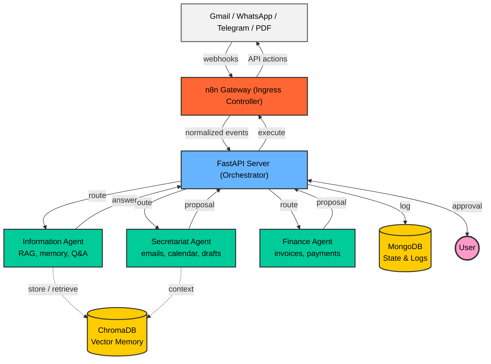

<div align="center">

# 🧠 myOS — מערכת הפעלה אישית מבוססת AI

**עוזר אישי חכם שרץ מקומית על המחשב שלך — מנהל מיילים, יומן, כספים ותקשורת, בלי לוותר על שליטה.**

[](https://python.org)
[](https://fastapi.tiangolo.com)
[](https://ai.google.dev)
[](https://docker.com)
[](https://mongodb.com)
[](LICENSE)

[🇬🇧 Read in English (English Version)](README.md)

</div>

---

<div dir="rtl">

## 📌 מה זה myOS?

**myOS** היא מערכת AI אישית שרצה מקומית על המחשב שלך ומתפקדת כ"מערכת הפעלה אישית". היא מחוברת ל-Gmail, Google Calendar, WhatsApp ו-Telegram ויודעת:

- 📧 **לנתח מיילים נכנסים** — לזהות ספאם, בקשות לפגישות ומשימות פעילות
- 📅 **לנהל יומן חכם** — לבדוק זמינות, להציע שעות ולקבוע פגישות
- ✍️ **לנסח טיוטות** — לכתוב תגובות מקצועיות בעברית ובאנגלית
- 💰 **לזהות חשבוניות ותשלומים** — לחלץ סכומים ותאריכים מ-PDF ומיילים
- 🧠 **לזכור הכל** — עם מערכת RAG שמאחסנת ושולפת מידע לפי הקשר

> **🔒 עקרון מפתח: Human-in-the-Loop** — שום פעולה רגישה לא מתבצעת ללא אישור מפורש שלך.

</div>

---

<div dir="rtl">

## 🎬 הדגמה

### 🗑️ זיהוי ספאם אוטומטי

מייל פרסומי מגיע ל-Gmail. המערכת מזהה מילות מפתח כמו "sale", "unsubscribe" ו-"70% off", מסווגת כספאם, ומעבירה אוטומטית לאשפה — ללא צורך באישור כי רמת הסיכון היא "safe".

</div>


<div dir="rtl">

**לוג השרת** — צינור קבלת ההחלטות של ה-AI בזמן אמת:

</div>


<div dir="rtl">

### 📅 קביעת פגישה — תהליך אישור מלא

מייל עם בקשה לפגישה מגיע. המערכת מנתחת את התוכן, בודקת זמינות ביומן, מנסחת טיוטת תגובה מקצועית, ושולחת בקשת אישור דרך Telegram. המשתמש עונה "כן" והאירוע נוצר ביומן Google באופן אוטומטי.

</div>


---

<div dir="rtl">

## 🏗️ ארכיטקטורה

המערכת בנויה בארכיטקטורת **Event-Driven Centralized Orchestration** עם **Human-in-the-Loop**. n8n משמש כ-**Ingress Controller** — הוא קולט webhooks ואירועים נכנסים (מייל חדש, הודעת וואטסאפ) ודוחף אותם לשרת ה-FastAPI. השרת מעבד, מנתב לסוכנים המתמחים ומגיב חזרה דרך n8n לביצוע.

</div>



<div dir="rtl">

### זרימת המידע

1. **קליטה** — n8n קולט webhooks משירותים חיצוניים ודוחף אירועים מנורמלים לשרת FastAPI
2. **ניתוב** — השרת מנתב את הבקשה לסוכן המתמחה המתאים לניתוח
3. **עיבוד** — הסוכן מנתח את הקלט ומחזיר הצעה (טיוטת תגובה, אירוע ביומן, סיווג)
4. **התראה** — השרת שולח סיכום קריא בחזרה דרך n8n לוואטסאפ/טלגרם, ומבקש אישור
5. **אישור** — המשתמש מאשר או דוחה; n8n מעביר את ההחלטה חזרה לשרת
6. **ביצוע** — לאחר אישור, השרת מורה ל-n8n לבצע את הפעולה

</div>

<div dir="rtl">

### הסוכנים

</div>

| סוכן | תפקיד | סטטוס |
|------|--------|-------|
| 🗂️ **סוכן המזכירות** | סיווג מיילים, ניסוח טיוטות, ניהול יומן | ✅ פעיל |
| 📚 **סוכן המידע** | RAG, זיכרון לטווח ארוך, שאלות ותשובות | ✅ פעיל |
| 💰 **סוכן הכספים** | זיהוי חשבוניות, מעקב תשלומים | 🚧 בפיתוח |

---

<div dir="rtl">

## 🔐 אבטחה ופרטיות

- **100% Self-Hosted** — כל המערכת רצה מקומית על המחשב שלך. שום מידע לא נשלח לשרתים חיצוניים מעבר לקריאות API של מודל ה-AI.
- **ניהול סודות** — כל המפתחות והטוקנים נשמרים ב-`.env` ו-`token.json`, שניהם מוחרגים מ-Git דרך `.gitignore`.
- **OAuth 2.0** — גישה ל-Google APIs דרך פרוטוקול OAuth 2.0 עם הרשאות ממוקדות בלבד.
- **Human-in-the-Loop** — כל פעולה רגישה דורשת אישור מפורש שלך לפני ביצוע.
- **פרטיות בטיוטות** — טיוטות הקשורות ליומן משתמשות במונחים גנריים ("תפוס") במקום לחשוף פרטי אירועים.

</div>

---

<div dir="rtl">

## 🛠️ טכנולוגיות

</div>

| טכנולוגיה | תפקיד | למה? |
|-----------|--------|------|
| **Python 3.11** | שפת ליבה | תחביר נקי, אקוסיסטם AI/ML עשיר, תמיכה מובנית ב-async |
| **FastAPI** | פריימוורק ווב | ביצועים גבוהים עם async מובנה, דוקומנטציה אוטומטית, type safety |
| **Google Gemini** | מודל AI | יכולות מולטימודליות, תמיכה מעולה בעברית, מכסות API נדיבות |
| **ChromaDB** | מסד וקטורי | קל משקל ומשובץ — מושלם ל-RAG מקומי ללא תשתית חיצונית |
| **MongoDB** | מסד מסמכים | גמישות Schema-less למבני נתונים מגוונים |
| **n8n** | מנוע אוטומציה | בונה תהליכים ויזואלי לחיבור Gmail, WhatsApp, Telegram |
| **Docker Compose** | קונטיינריזציה | פקודה אחת להקמת כל 5 השירותים |
| **ngrok** | מנהרות | חשיפת השרת המקומי ל-webhooks חיצוניים |

---

<div dir="rtl">

## 🚀 התקנה מהירה

### דרישות מקדימות

- **Python 3.11+**
- **Docker & Docker Compose**
- **חשבון Google** עם Gmail API ו-Calendar API מופעלים
- **מפתח API של Google Gemini**

### 1. שכפול הפרויקט

</div>

```bash
git clone https://github.com/GolanLevi/myOS.git
cd myOS
```

<div dir="rtl">

### 2. הגדרת משתני סביבה

צור קובץ `.env` בתיקיית השורש:

</div>

```env
GOOGLE_API_KEY=your_gemini_api_key_here
NGROK_AUTHTOKEN=your_ngrok_token_here
```

<div dir="rtl">

### 3. הגדרת Google OAuth

1. צור פרויקט ב-[Google Cloud Console](https://console.cloud.google.com/)
2. הפעל את **Gmail API** ו-**Calendar API**
3. צור OAuth 2.0 Credentials והורד את `credentials.json` לתיקיית השורש
4. הרץ את סקריפט האימות:

</div>

```bash
python auth_setup.py
```

<div dir="rtl">

> זה ייצור קובץ `token.json` לגישה אוטומטית ל-Gmail ו-Calendar.

### 4. הרצה עם Docker Compose

</div>

```bash
docker-compose up --build
```

| שירות | פורט | תיאור |
|-------|------|--------|
| **myOS Server** | `8080` | שרת FastAPI ראשי |
| **MongoDB** | `27017` | מסד נתונים למצבים ולוגים |
| **ChromaDB** | `8001` | מסד וקטורי ל-RAG |
| **n8n** | `5678` | מנוע אוטומציה |
| **ngrok** | `4040` | דשבורד מנהרה |

<div dir="rtl">

### 5. הרצה מקומית (ללא Docker)

</div>

```bash
pip install -r requirements.txt
uvicorn server:app --host 0.0.0.0 --port 8000 --reload
```

<div dir="rtl">

> ⚠️ בהרצה מקומית יש לוודא ש-MongoDB ו-ChromaDB רצים בנפרד.

</div>

---

<div dir="rtl">

## 📡 נקודות קצה (API)

</div>

| Endpoint | Method | תיאור |
|----------|--------|--------|
| `/` | GET | בדיקת חיבור — "myOS is alive!" |
| `/analyze_email` | POST | ניתוח מייל נכנס (סיווג, טיוטה, פגישה) |
| `/ask` | POST | שיחת צ'אט חכמה עם ניהול אישורים |
| `/memorize` | POST | שמירת מידע בזיכרון לטווח ארוך |
| `/execute` | POST | ביצוע פעולה ישיר |
| `/webhook/whatsapp` | POST | קבלת תגובות מ-WhatsApp |
| `/register_message_map` | POST | רישום מזהה הודעה לטלגרם |

---

<div dir="rtl">

## 📁 מבנה הפרויקט

</div>

```
myOS/
├── server.py                 # 🧠 שרת FastAPI — הלב הפועם של המערכת
├── agents/
│   ├── secretariat_agent.py  # 📧 סיווג מיילים, יומן, טיוטות
│   ├── information_agent.py  # 📚 זיכרון RAG, שליפת ידע
│   └── finance_agent.py      # 💰 זיהוי חשבוניות, מעקב תשלומים
├── core/
│   ├── protocols.py          # 📜 פרוטוקולים ומודלים משותפים
│   └── state_manager.py      # 🔄 ניהול מצב ותהליך אישורים
├── utils/
│   ├── gmail_tools.py        # ✉️ פונקציות Gmail API
│   ├── gmail_connector.py    # 🔌 חיבור OAuth ל-Gmail
│   └── calendar_tools.py     # 📅 פונקציות Google Calendar API
├── docs/
│   ├── architecture.md       # 🏗️ תיעוד ארכיטקטורה מלא
│   └── project_summary.md    # 📋 סיכום טכני של הפרויקט
├── docker-compose.yml        # 🐳 הגדרת כל השירותים
├── Dockerfile                # 📦 בניית קונטיינר השרת
├── requirements.txt          # 📦 תלויות Python
├── user_config.json          # ⚙️ כללי סיווג מותאמים אישית
├── auth_setup.py             # 🔑 סקריפט הגדרת OAuth
└── .env                      # 🔒 משתני סביבה (לא נכלל ב-Git)
```

---

<div dir="rtl">

## 🔄 תרחישי שימוש

### 📧 ניתוח מייל נכנס

</div>

```
New email → n8n webhook → /analyze_email → Classification (spam/meeting/task)
  → Draft response / Calendar event → Notify user → Approval → Execute
```

<div dir="rtl">

### 💬 שאלה חכמה (RAG)

</div>

```
"How much did we pay the electric company?" → /ask → Memory search → Summarized answer
```

<div dir="rtl">

### ✅ אישור פעולה

</div>

```
"Yes" on WhatsApp → /webhook/whatsapp → Execute pending action → ✅ Done
```

---

<div dir="rtl">

## ⚙️ קונפיגורציה

קובץ `user_config.json` מאפשר להגדיר כללי סיווג מותאמים אישית:

</div>

```json
{
  "user_name": "Golan",
  "rules": [
    {
      "topic": "Spam & Newsletters",
      "keywords": ["unsubscribe", "sale", "newsletter"],
      "action": "trash",
      "risk": "safe"
    },
    {
      "topic": "Job Interview / Progress",
      "keywords": ["interview", "schedule a call", "next steps"],
      "action": "notify_user",
      "risk": "safe"
    }
  ]
}
```

---

<div dir="rtl">

## 🗺️ מפת דרכים

- [x] סוכן המזכירות — סיווג מיילים, ניסוח טיוטות, ניהול יומן
- [x] סוכן המידע — RAG עם ChromaDB, זיכרון לטווח ארוך
- [x] מנגנון Human-in-the-Loop — אישורים דרך WhatsApp/Telegram
- [x] Docker Compose — הקמה מלאה עם כל השירותים
- [x] ניהול אנשי קשר — שמירה ושליפה אוטומטית
- [ ] סוכן הכספים — חיבור מלא ל-server.py
- [ ] ספר חשבונות מאוחד (Unified Ledger)
- [ ] ממשק משתמש (Dashboard)
- [ ] חיבור לחשבונות בנק
- [ ] סוכנים נוספים (LinkedIn, Slack)
- [ ] התראות פרואקטיביות חכמות

</div>

---

<div dir="rtl">

## 🤝 תרומה

הפרויקט נמצא בשלבי פיתוח מוקדמים. נשמח לתרומות!

</div>

1. Fork the repo
2. Create your branch (`git checkout -b feature/amazing-feature`)
3. Commit your changes (`git commit -m 'Add amazing feature'`)
4. Push to the branch (`git push origin feature/amazing-feature`)
5. Open a Pull Request

---

<div dir="rtl">

## 📄 רישיון

פרויקט זה תחת רישיון MIT — ראה את קובץ [LICENSE](LICENSE) לפרטים.

</div>

---

<div align="center">

**נבנה עם ❤️ ו-AI**

*myOS — כי את החיים שלך צריך לנהל כמו מערכת הפעלה.*

</div>
