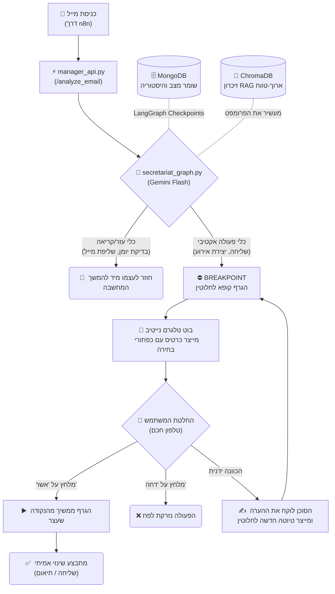

<div align="center">

# 🧠 myOS — מערכת ההפעלה האישית החכמה שלי

> טבעתי במיילים, פספסתי פגישות וקפצתי כל היום בין אפליקציות. אז בתיקייה הזו הקמתי לעצמי סוכן AI אישי (LangGraph) שמנהל עבורי את החיים הדיגיטליים (Gmail, Calendar, Telegram) — עם פרטיות מוחלטת והקפדה על אישור אנושי לפני כל פעולה רגישה.

[🇬🇧 Read in English](README.md)

</div>

---

## 📌 למה פיתחתי את זה?

היי! 👋 אני גולן, מפתח ג'וניור שחי, נושם, ואוהב לבנות מערכות מבוססות GenAI. התחלתי את פיתוח **myOS** פשוט כי נמאס לי מ"אפליקציות פרודוקטיביות" גנריות. לא רציתי עוד דשבורד — רציתי *תאום דיגיטלי*. מישהו (או משהו) שמבין את ההקשר שלי, שזוכר היסטוריה משיחות קודמות, שבודק את היומן שלי לפני שאני בכלל מבקש, אבל **לעולם לא יעשה פעולה קריטית בלי לחכות לאישור מפורש ממני**.

הפילוסופיה של הפרויקט הזה ממש פשוטה:
- ה-AI עושה את העבודה השחורה: **מנתח, מנסח המלצות, ומכין טיוטות.**
- **פעולות רגישות** (כמו לשגר מייל לעולם או לקבוע אירוע ביומן) תמיד עוצרות, ומחכות ללחיצת כפתור שלי דרך הבוט בטלגרם.
- כל המידע נשאר בבית. אין פה "שירות ענן רואה הכל", הכל פוצל ונבנה מאפס על המכונה המקומית שלי.

---

## 🛠️ מאחורי הקלעים: איך בניתי את זה?

לבנות מערכת כזו משלב 0 זה מורכב. המעבר מסקריפט רגיל שרץ שורה אחרי שורה ל-**Stateful Cyclic Graph** (מכונת מצבים שזוכרת וחוזרת אחורה לנתב כלים) דרש המון ניסוי וטעייה. כדי ללמוד עמוק ולרוץ מהר, עבדתי צמוד אל מול כלי פיתוח AI מתקדמים — ספציפית השתמשתי ב-**Codex** וב-**Antigravity**.

העבודה איתם ב-"Pair Programming" איפשרה לי לעשות פרוטוטייפינג זריז לארכיטקטורת ה-LangGraph המורכבת, לדייק את ה-Tool Bindings (כדי שג'מיני באמת יבין איזה פונקציות Gmail מותר לו להריץ), ולדבג לופים אינסופיים בקוד של הסוכן. זו הייתה חוויה מדהימה של איך *לבנות* AI *בעזרת* AI, ששיפרה את הראייה הארכיטקטונית שלי פי מאה.

---

## 📬 המסע של מייל במערכת (3 דוגמאות חיות)

הדרך הכי טובה להבין את הקסם פה היא לראות מה קורה מאחורי הקלעים ברגע שמייל אמיתי נוחת בתיבה ומוקפץ למערכת שלי (דרך n8n):

### תרחיש 1: תיאום פגישה מהאגדות
*מישהו מבקש להיפגש איתי שבוע הבא.*
1. **חילוץ הקשר:** סוכן ה-LangGraph קורא את הבקשה ומבין שיש פה כוונה לתיאום.
2. **הפעלת כלי שקוף:** הסוכן מפעיל עצמאית את הכלי `get_free_slots` וקורא את הזמינות האמיתית שלי מה-Google Calendar.
3. **ניסוח נקי:** הוא כותב עבורי תשובה מנומסת שמציעה את השעות הפנויות שלי ובשפת המקור של השולח.
4. **עצירה (HITL):** מכיוון שמשלוח מייל מוגדר "כלי רגיש", הגרף *קופא במקום*. הוא משגר אלי לטלגרם כרטיסייה מעוצבת למשעי.
5. **האישור שלי:** אני קורא את התקציר ולוחץ על כפתור Inline בטלגרם: "אשר וסנכרן ליומן".
6. **הקסם פועל:** הגרף מתעורר חזרה, יורה את הכלים `send_email` ו-`create_event`, ובלי להקליד מילה קבעתי פגישה ועניתי למייל.

> ⬇️ **דמו: הזרימה המלאה של אישור פגישה בטלגרם**
> 
> *[Placeholder: Add image `demo_meeting_flow.png` here showing the complete workflow of the AI proposing times and creating an event]*

### תרחיש 2: אזעקת אמת! (התראה דחופה)
*קיבלתי מייל עם התראה קריטית ממערכת או הודעה בוערת.*
1. **סיווג אגרסיבי:** הסוכן מנתח את התוכן ומזהה חותמות של דחיפות גבוהה.
2. **עקיפת התור הרגיל:** הוא מבין שזה לא זמן "להכין טיוטה יפה" ולחכות שאאשר אותה בנוחות שלי.
3. **פינג מיידי:** הוא משגר לי את תמצית המשבר להודעות פוש בטלגרם בצבע אדום, כדי שאקבל החלטה ואדע בדיוק על מה מדובר מבלי להיכנס בכלל לאפליקציית האימייל.

> ⬇️ **דמו: טיפול אינסטנט בהתראה דחופה**
> 
> *[Placeholder: Add image `demo_urgent_alert.png` here showing the high-priority red alert card]*

### תרחיש 3: השומר השקט (ספאם ושיווק)
*עוד ניוזלטר ששכחתי להימחק ממנו או פרסומת מהבנק.*
1. **זיהוי:** הסוכן מזהה את הטרמינולוגיה השיווקית ומתייג כספאם.
2. **פעולה שקטה:** מכיוון שהמערכת מאשרת לסוכן להעביר ספאם לאשפה כפעולה "בטוחה" (Safe Tool), הכלי `trash_email` מופעל מיד.
3. **אפס הסחות דעת:** הגרף מסתיים. הטלפון שלי בכלל לא רטט. חסכתי עוד 2 דקות של פוקוס היום.

> ⬇️ **דמו: מאלפים את תיקיית הספאם**
> 
> *[Placeholder: Add image `demo_spam.png` here showing the terminal traces deleting marketing junk automatically]*

---

## 🏗️ ארכיטקטורת המערכת

המוח של המערכת יושב בקובץ `secretariat_graph.py` ומונגש לעולם באמצעות `manager_api.py`. השתמשתי פה ב-**LangGraph Stateful Cyclic Graph** — מנגנון חכם שמאפשר לסוכן "לחשוב", להפעיל כלים (קריאות API לחיפוש ביומן, במיילים), לחזור חזרה ולשאול את עצמו האם צריך עוד כלים או שיש צורך לדרוש אישור משתמש (Breakpoint).



### טכנולוגיות (Stack)

| שכבה | טכנולוגיה |
|---|---|
| **אורקסטרציה** | LangGraph (Stateful Cyclic Graphs & Breakpoints) |
| **מנוע חשיבה (LLM)** | Google Gemini SDK (`gemini-flash-latest`) |
| **שרת וכניסת נתונים** | FastAPI + Uvicorn |
| **דיאגרמות ומסדי נתונים** | ChromaDB (זיכרון) + MongoDB (שמירת המצב הקודם) |
| **קישוריות (APIs)** | Google Workspace APIs (Gmail, Calendar) · Telegram Bot API |
| **הדק חיצוני (Ingestion)** | n8n (Webhook Automation) |
| **שפה וסביבה** | Python 3.11 · שמירה ופריסה בעזרת Docker Compose |

---

## 🗂️ מבנה ספריות

```text
myOS/
├── agents/
│   ├── secretariat_graph.py   # מנוע ה-LangGraph שמתפעל את הלוגיקה וה-HITL
│   ├── information_agent.py   # סוכן RAG מחובר ל-ChromaDB
│   └── finance_agent.py       # מפענח חשבוניות (בעבודה)
│
├── bot/
│   ├── telegram_bot.py        # אינטגרציית טלגרם וכתיבת בוט נייטיב
│   └── message_formatter.py   # צייר הכרטיסיות שעושה סדר בעיניים (קריאות וסיכומים)
│
├── utils/
│   ├── gmail_tools_lc.py      # מעטפת לכלי API של GMAIL מותאמת ל-LangChain
│   ├── calendar_tools_lc.py   # מעטפת ליומן מותאמת באופן מלא לסוכן
│   └── logger.py              # צביעה וסידור הלוגים במערכת ההפעלה
│
├── manager_api.py             # סרבר הFastAPI החשוף (השער החיצוני למערכת)
├── main.py                    # רץ על ת'רדים לפייסבוק וגם הקשבה לטלגרם
└── docker-compose.yml         # לכל השרתים והDB
```

---

## 🚀 התחנה הבאה / איך זה רץ אצלי

אם בא לכם לפרוס OS משלכם, תצטרכו:

1. פרויקט Cloud Platform של גוגל פתוח עם `credentials.json` עבור GMAIL ו-Calendar.
2. יצירת בוט טלגרם (`@BotFather`) למשיכת Token.
3. קבלת מפתח Gemini API גנרי מהאולפן של AI studio.
4. להריץ: `docker-compose up`

---

## 🔐 מילת סיום על פרטיות ואבטחה

בניתי את הדבר הזה בשבילי, ולכן אין לאבטחה הנחת סלב. 
קובצי `token.json` ו-`.env` בחיים לא הועלו או יעלו מחוץ לתיקייה הלוקאלית. הפקודות המשנות סדרי עולם (כמו לשגראו למחוק) חסומות Hardcoded בתוך ה-`interrupt_before` array ב-LangGraph. שום Prompt-Injection מתוחכם במייל נכנס לא יכול לעקוף אישור פיזי על מסך הפלאפון שלי בטלגרם. מערכת סגורה, מנוהלת ויציבה. אופסטציה כמעט מוחלטת של טעויות של הבינה המלאכותית.

---

## 📄 רישיון

MIT, מרגישים שזה השפיע עליכם? הרגישו חופשי לעשות למאגר Fork ולשחק איך שבא לכם.

**גולן לוי** 
[github.com/GolanLevi](https://github.com/GolanLevi)
