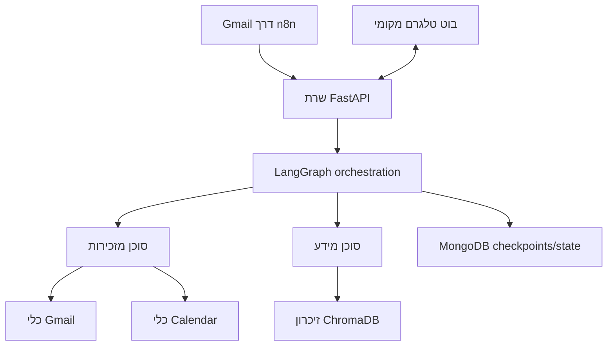

# myOS

מערכת הפעלה אישית מבוססת AI לניהול מיילים, יומן, זיכרון ואישורים דרך טלגרם.

[](https://python.org)
[](https://fastapi.tiangolo.com)
[](https://www.langchain.com/langgraph)
[](https://www.docker.com/)
[](LICENSE)

[English](README.md)

## סקירה

`myOS` הוא פרויקט של עוזר אישי מקומי שמחבר בין Gmail, Google Calendar, Telegram, זיכרון וקטורי וסוכני AI למערכת אחת.

הרעיון המוביל של הפרויקט:

- ה-AI יכול לנתח, לסכם, לנסח ולהציע
- פעולות רגישות חייבות לעצור לאישור מפורש של המשתמש
- הנתונים והסודות נשארים בשליטה מקומית

כרגע המערכת מתמקדת בארבעה מסלולים עיקריים:

- מיון וטיפול במיילים
- תיאום פגישות ועדכון יומן
- כרטיסי אישור בטלגרם עם כפתורים
- זיכרון ארוך טווח באמצעות חיפוש וקטורי

## מצב נוכחי

הקוד הנוכחי מריץ שרת FastAPI עם שכבת orchestration מבוססת LangGraph, בוט טלגרם מקומי, אינטגרציות ל-Gmail ול-Google Calendar, זיכרון דרך ChromaDB ושמירת state דרך MongoDB.

`n8n` משמש כרגע בעיקר לשכבת ה-ingestion של Gmail. טלגרם מטופל ישירות מתוך אפליקציית ה-Python.

## מה המערכת יודעת לעשות היום

- לקבל payload של מיילים נכנסים ולנתב אותם דרך LangGraph
- לזהות ספאם והודעות בעלות ערך נמוך
- להכין טיוטות מייל לפני שליחה
- לבדוק חלונות זמן פנויים לפני הצעת פגישה
- ליצור, לעדכן או לבטל אירועים מאחורי שער אישור אנושי
- לשמור הקשר שיח ותהליך דרך MongoDB checkpoints
- לשמור ולשלוף מידע שימושי דרך ChromaDB
- לשלוח סיכומים ובקשות אישור לטלגרם עם inline buttons

## דוגמאות שכדאי להציג בריפו

אלה הנכסים הכי חזקים להצגה ציבורית:

- [`docs/demo_spam.png`](docs/demo_spam.png): דוגמת מיון אוטומטי של ספאם
- [`docs/demo_spam_terminal.png`](docs/demo_spam_terminal.png): trace של עיבוד בצד השרת
- [`docs/demo_meeting_flow.png`](docs/demo_meeting_flow.png): זרימת אישור מלאה של פגישה בטלגרם
- [`docs/n8n_workflow_export.cleaned.json`](docs/n8n_workflow_export.cleaned.json): ייצוא n8n נקי ומסונן
- [`test_telegram_native_formatter.py`](test_telegram_native_formatter.py): בדיקה ממוקדת ל-UX של אישורים בטלגרם

### מיון ספאם


### אישור פגישה בטלגרם


## ארכיטקטורה



## סטאק טכנולוגי

- Python 3.11
- FastAPI + Uvicorn
- LangChain + LangGraph
- תמיכה בספקי LLM כמו Gemini, Anthropic ו-Groq
- Google Gmail API + Google Calendar API
- python-telegram-bot
- ChromaDB
- MongoDB
- n8n
- Docker Compose

## התחלה מהירה

### 1. שכפול

```bash
git clone https://github.com/GolanLevi/myOS.git
cd myOS
```

### 2. קונפיגורציה מקומית

- ליצור `.env` לפי [`.env.example`](.env.example)
- לעדכן את [`user_config.json`](user_config.json) או להתחיל מ-[`user_config.example.json`](user_config.example.json)
- לשים `credentials.json` בתיקיית השורש

משתני סביבה מומלצים:

```env
GOOGLE_API_KEY=...
GROQ_API_KEY=...
ANTHROPIC_API_KEY=...
TELEGRAM_BOT_TOKEN=...
TELEGRAM_CHAT_ID=...
NGROK_AUTHTOKEN=...
N8N_WEBHOOK_URL=https://your-public-url.example.com
```

### 3. אימות מול Google

```bash
python auth_setup.py
```

הסקריפט יוצר `token.json` מקומי עבור Gmail ו-Google Calendar. הקובץ הזה מוחרג בכוונה מ-Git.

### 4. הרצה עם Docker

```bash
docker compose up --build
```

השירותים ב-stack:

- `server` - שרת FastAPI והבוט של טלגרם
- `mongo` - שמירת state ו-checkpoints
- `chromadb` - זיכרון וקטורי
- `n8n` - workflow ingestion של Gmail
- `ngrok` - tunnel אופציונלי לחשיפה מקומית

### 5. הרצה מקומית בלי Docker

```bash
pip install -r requirements.txt
python main.py
```

במצב מקומי צריך לוודא ש-MongoDB ו-ChromaDB זמינים.

## API עיקרי

- `GET /` - בדיקת בריאות
- `POST /ask` - צ'אט, אישורים ובקשות למערכת
- `POST /analyze_email` - ניתוח מיילים נכנסים
- `POST /memorize` - שמירת טקסט לזיכרון ארוך טווח
- `POST /execute` - endpoint ישן לתאימות

## מבנה הריפו

```text
myOS/
|-- agents/                  # סוכנים וגרף LangGraph
|-- bot/                     # בוט טלגרם ופורמט הודעות
|-- core/                    # פרוטוקולים וניהול state
|-- docs/                    # צילומי מסך ותיעוד תומך
|-- utils/                   # כלי Gmail, Calendar, logging ו-tool wrappers
|-- main.py                  # הרצת FastAPI ו-Telegram polling
|-- server.py                # נקודת הכניסה הראשית
|-- docker-compose.yml       # ה-stack המקומי
|-- user_config.json         # קונפיגורציית דוגמה ציבורית
|-- user_config.example.json # קובץ התחלה נוסף
```

## אבטחה ופרטיות

- סודות אמורים להישמר מקומית בקבצים כמו `.env`, `credentials.json` ו-`token.json`
- הריפו הציבורי מנוקה מקבצי DB, טוקנים וייצואים אישיים
- פעולות רגישות אמורות לעצור לאישור מפורש
- תשובות על זמינות ביומן צריכות לחשוף תוצאה בלבד, לא פרטים אישיים

## Roadmap

- הרחבת ה-flow הפיננסי מזיהוי למסלול review מלא
- הוספת dashboard קליל לניהול state, memory ואישורים
- הגדלת כיסוי הבדיקות לניתוב של LangGraph ול-interception של tools
- הוספת fixtures ודוגמאות importable לפיתוח מקומי

## רישיון

MIT. ראו [LICENSE](LICENSE).
