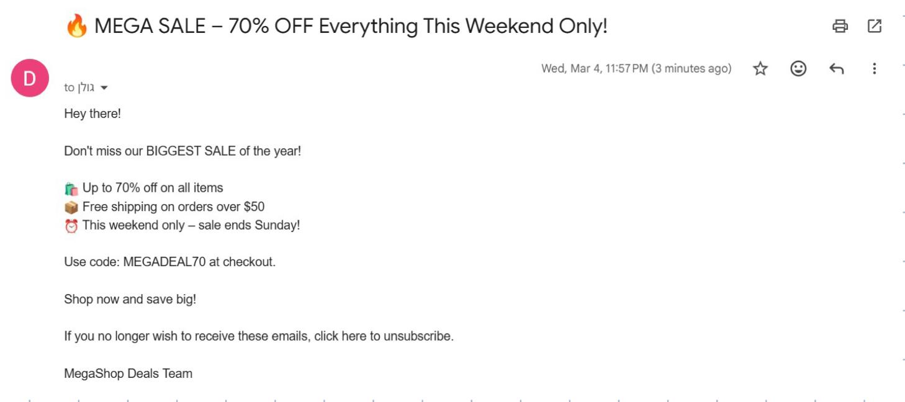
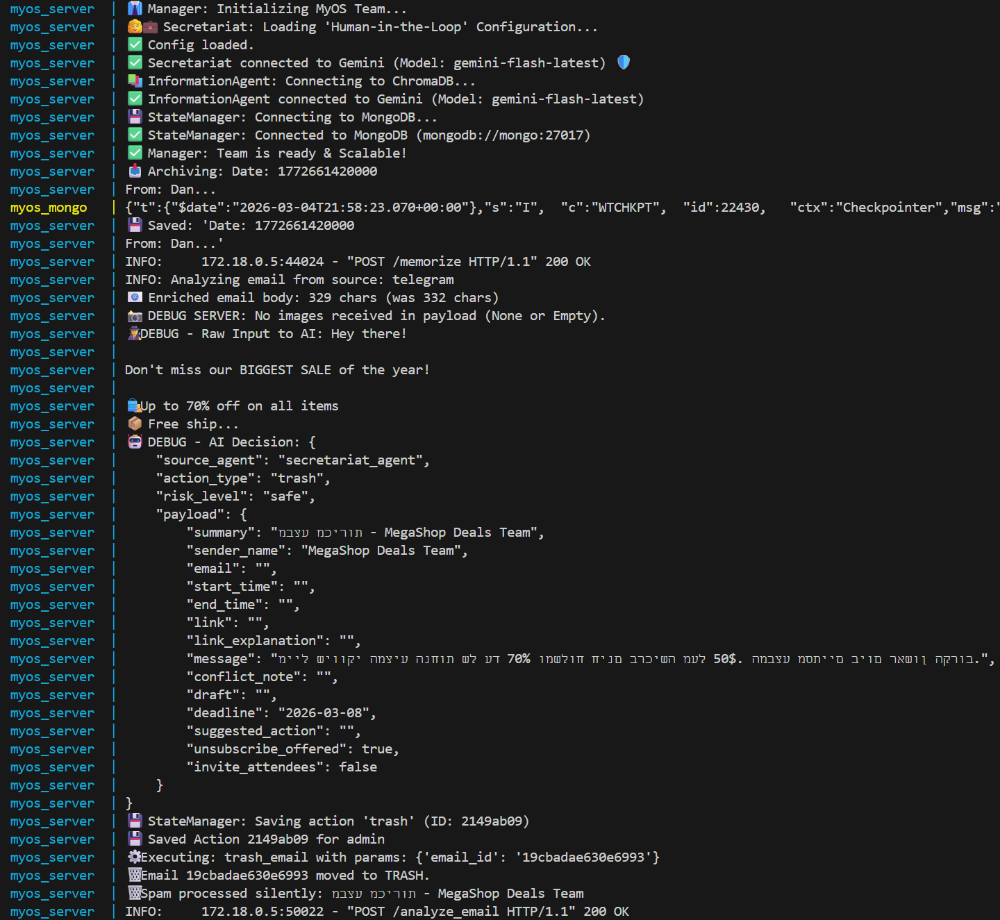
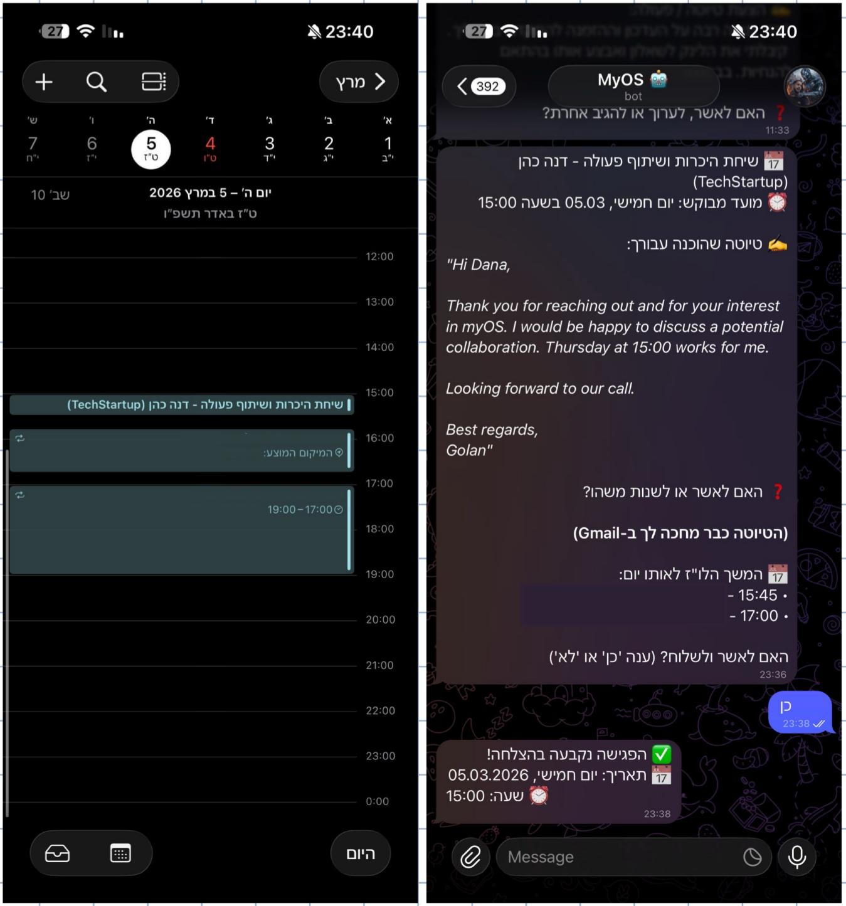
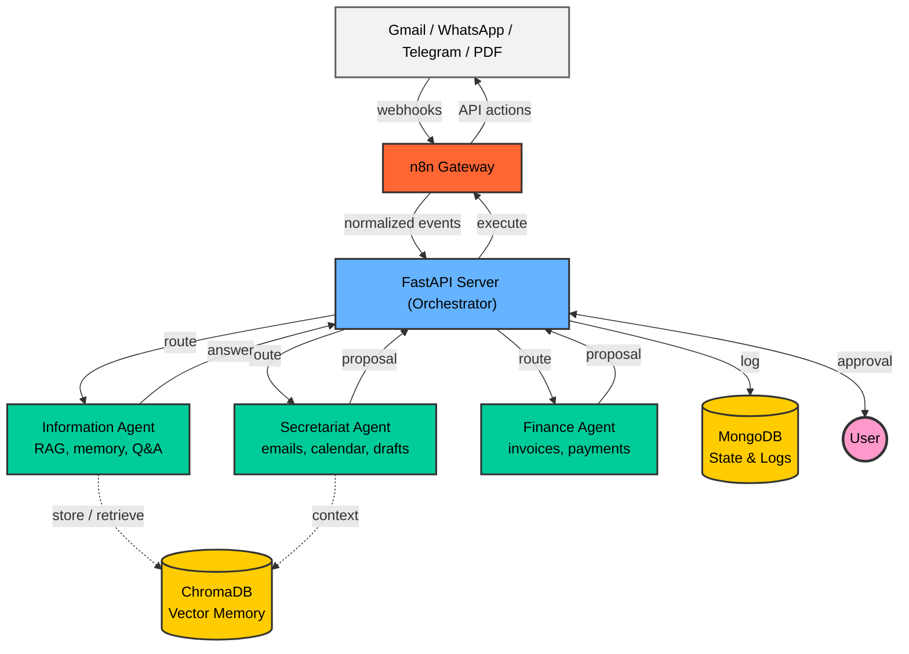

<div align="center">

# 🧠 myOS — מערכת הפעלה אישית מבוססת AI

מערכת AI שבניתי כדי לנהל את החיים הדיגיטליים שלי — מיילים, יומן, כספים ותקשורת — הכל ממקום אחד, רץ מקומית על המחשב.

[](https://python.org)
[](https://fastapi.tiangolo.com)
[](https://ai.google.dev)
[](https://docker.com)
[](https://mongodb.com)
[](LICENSE)

[🇬🇧 Read in English (English Version)](README.md)

</div>

---

<div dir="rtl">

## 📌 מה זה myOS?

בניתי את **myOS** בגלל בעיה אמיתית שלי: הייתי טובע במיילים, מפספס פגישות, ומאבד מידע שפזור בין Gmail, וואטסאפ וטלגרם. במקום לעבוד עם עשר אפליקציות שונות, החלטתי לבנות מערכת אחת שמחוברת לכולן ומטפלת בדברים השגרתיים בשבילי.

המערכת רצה על המחשב שלי ומשתמשת ב-Gemini של Google כדי להבין הודעות נכנסות, לסווג אותן, לנסח תשובות ולנהל את היומן. הרעיון המרכזי הוא **Human-in-the-Loop** — ה-AI מציע פעולות, אבל שום דבר רגיש לא קורה בלי שאני מאשר.

**מה המערכת עושה כרגע:**
- 📧 קוראת מיילים נכנסים ומסווגת אותם (ספאם, בקשות לפגישות, משימות)
- 📅 בודקת זמינות ביומן וקובעת פגישות
- ✍️ מנסחת תשובות מקצועיות בעברית ובאנגלית
- 💰 מזהה חשבוניות ומיילים הקשורים לתשלומים *(בפיתוח)*
- 🧠 שומרת ושולפת מידע דרך זיכרון מבוסס RAG

</div>

---

<div dir="rtl">

## 🎬 הדגמה

### 🗑️ זיהוי ספאם אוטומטי

כשמייל פרסומי כזה מגיע, המערכת מזהה אותו כספאם לפי מילות מפתח כמו "sale", "unsubscribe" ו-"70% off", ומעבירה אותו ישירות לאשפה. מכיוון שרמת הסיכון מוגדרת "safe", לא צריך אישור מהמשתמש.

</div>



<div dir="rtl">

ככה זה נראה בלוגים של השרת תוך כדי עיבוד:

</div>



<div dir="rtl">

### 📅 קביעת פגישה — התהליך המלא

זה הפיצ'ר שאני הכי גאה בו. מייל עם בקשה לפגישה מגיע, והמערכת:
1. מנתחת את תוכן המייל
2. בודקת את יומן Google לחפיפות
3. מנסחת טיוטת תגובה
4. שולחת לי הודעה בטלגרם ושואלת אם לאשר

אני עונה "כן", והאירוע נוצר ביומן אוטומטית.

</div>



---

<div dir="rtl">

## 🏗️ ארכיטקטורה

המערכת בנויה סביב **תזמור מרכזי** (centralized orchestration). הרעיון בגדול:

- **n8n** מאזין לאירועים חיצוניים (מייל חדש, הודעת וואטסאפ) ומעביר אותם לשרת
- **שרת FastAPI** הוא המוח — הוא מחליט איזה סוכן צריך לטפל בבקשה
- כל **סוכן** מתמחה בתחום אחר (מיילים, זיכרון, כספים)
- השרת שולח את התוצאה חזרה דרך n8n כדי להודיע לי, ומחכה לאישור שלי לפני שהוא מבצע פעולות רגישות

</div>



<div dir="rtl">

### איך המידע זורם במערכת

1. **קליטה** — n8n קולט אירוע (מייל חדש, הודעה) ושולח אותו לשרת FastAPI
2. **ניתוב** — השרת מזהה איזה סוכן צריך לטפל בזה
3. **עיבוד** — הסוכן מנתח את הקלט ומחזיר הצעה (למשל: "זה ספאם, למחוק" או "זו בקשה לפגישה, הנה טיוטת תשובה")
4. **התראה** — השרת שולח לי סיכום בטלגרם/וואטסאפ ושואל מה לעשות
5. **אישור** — אני מאשר או דוחה
6. **ביצוע** — אם אישרתי, השרת מורה ל-n8n לבצע את הפעולה

</div>

<div dir="rtl">

### הסוכנים

</div>

| סוכן | מה הוא עושה | סטטוס |
|------|------------|-------|
| 🗂️ **סוכן המזכירות** | מסווג מיילים, מנסח תשובות, מנהל את היומן | ✅ פעיל |
| 📚 **סוכן המידע** | שומר ושולף מידע דרך RAG (ChromaDB) | ✅ פעיל |
| 💰 **סוכן הכספים** | מזהה חשבוניות ועוקב אחרי תשלומים | 🚧 בפיתוח |

---

<div dir="rtl">

## 🔐 אבטחה ופרטיות

מכיוון שהמערכת נוגעת במידע רגיש (מיילים, יומן, ובעתיד אולי גם חשבונות בנק), השקעתי בלהוסיף שכבות הגנה:

- **רץ מקומית** — הכל רץ על המחשב שלי. שום מידע לא יוצא החוצה, חוץ מקריאות ל-API של Gemini לעיבוד טקסט.
- **סודות נשארים מקומיים** — מפתחות וטוקנים שמורים ב-`.env` ו-`token.json`, ששניהם מוחרגים מ-Git.
- **OAuth 2.0** — הגישה ל-Google APIs עוברת דרך OAuth עם הרשאות מינימליות.
- **כלום לא קורה בלי אישור** — פעולות רגישות כמו שליחת מיילים או קביעת פגישות דורשות אישור מפורש.
- **פרטיות ביומן** — כשהמערכת מנסחת תשובות על זמינות, היא כותבת "תפוס" במקום לחשוף מה האירוע בפועל.

</div>

---

<div dir="rtl">

## 🛠️ טכנולוגיות

</div>

| טכנולוגיה | מה עושה | למה בחרתי בה |
|-----------|---------|-------------|
| **Python 3.11** | שפת הליבה | מתאימה לעבודה עם AI, תחביר נקי, תמיכה ב-async |
| **FastAPI** | שרת API | מהיר, async כברירת מחדל, מייצר תיעוד API אוטומטי, עובד טוב עם Pydantic |
| **Google Gemini** | מודל שפה | מבין גם טקסט וגם תמונות, עובד טוב עם עברית, שכבה חינמית נדיבה |
| **ChromaDB** | מסד וקטורי ל-RAG | רץ מקומית בלי שום הגדרות, קל משקל, מתאים לגישה של self-hosted |
| **MongoDB** | אחסון נתונים | סכמה גמישה — אפשר לאחסן סוגי מידע שונים (חשבוניות, הודעות, אירועים) בלי מבנה קשיח |
| **n8n** | אוטומציה | מחבר ל-Gmail, וואטסאפ וטלגרם בצורה ויזואלית — חוסך הרבה קוד של אינטגרציות |
| **Docker Compose** | הרצת הכל ביחד | פקודה אחת מרימה את כל 5 השירותים, קל להעתקה למחשב אחר |
| **ngrok** | חשיפת השרת | צריך בשביל שוואטסאפ וטלגרם יוכלו לשלוח webhooks לשרת המקומי |

---

<div dir="rtl">

## 🚀 איך מתחילים

### דרישות מקדימות

- **Python 3.11+**
- **Docker & Docker Compose**
- **חשבון Google** עם Gmail API ו-Calendar API מופעלים
- **מפתח API של Google Gemini**

### 1. שכפול הפרויקט

</div>

```bash
git clone https://github.com/GolanLevi/myOS.git
cd myOS
```

<div dir="rtl">

### 2. הגדרת משתני סביבה

צור קובץ `.env` בתיקיית הפרויקט:

</div>

```env
GOOGLE_API_KEY=your_gemini_api_key_here
NGROK_AUTHTOKEN=your_ngrok_token_here
```

<div dir="rtl">

### 3. הגדרת Google OAuth

1. צור פרויקט ב-[Google Cloud Console](https://console.cloud.google.com/)
2. הפעל את **Gmail API** ו-**Calendar API**
3. צור OAuth 2.0 Credentials והורד את `credentials.json` לתיקיית הפרויקט
4. הרץ את סקריפט ההגדרה:

</div>

```bash
python auth_setup.py
```

<div dir="rtl">

> ייווצר קובץ `token.json` שמאפשר גישה אוטומטית ל-Gmail וליומן.

### 4. הרצה עם Docker Compose

</div>

```bash
docker-compose up --build
```

| שירות | פורט | תיאור |
|-------|------|-------|
| **myOS Server** | `8080` | שרת FastAPI ראשי |
| **MongoDB** | `27017` | מסד נתונים |
| **ChromaDB** | `8001` | מסד וקטורי ל-RAG |
| **n8n** | `5678` | מנוע אוטומציה |
| **ngrok** | `4040` | דשבורד מנהרה |

<div dir="rtl">

### 5. הרצה מקומית (ללא Docker)

</div>

```bash
pip install -r requirements.txt
uvicorn server:app --host 0.0.0.0 --port 8000 --reload
```

<div dir="rtl">

> ⚠️ בהרצה מקומית צריך להרים MongoDB ו-ChromaDB בנפרד.

</div>

---

<div dir="rtl">

## 📡 נקודות קצה (API)

</div>

| Endpoint | Method | תיאור |
|----------|--------|-------|
| `/` | GET | בדיקת חיבור |
| `/analyze_email` | POST | ניתוח מייל נכנס (סיווג, טיוטה, קביעת פגישה) |
| `/ask` | POST | צ'אט — שאלות או אישור פעולות ממתינות |
| `/memorize` | POST | שמירת מידע בזיכרון לטווח ארוך |
| `/execute` | POST | ביצוע פעולה ישיר |
| `/webhook/whatsapp` | POST | קבלת תגובות מוואטסאפ |
| `/register_message_map` | POST | מיפוי מזהים פנימיים להודעות טלגרם |

---

<div dir="rtl">

## 📁 מבנה הפרויקט

</div>

```
myOS/
├── server.py                 # שרת ראשי — ניתוב בקשות וניהול אישורים
├── agents/
│   ├── secretariat_agent.py  # סיווג מיילים, יומן, ניסוח טיוטות
│   ├── information_agent.py  # זיכרון RAG ושליפת ידע
│   └── finance_agent.py      # זיהוי חשבוניות ומעקב תשלומים
├── core/
│   ├── protocols.py          # מודלים ופרוטוקולים משותפים
│   └── state_manager.py      # ניהול מצב ותהליך אישורים
├── utils/
│   ├── gmail_tools.py        # פונקציות עטיפה ל-Gmail API
│   ├── gmail_connector.py    # חיבור OAuth ל-Gmail
│   └── calendar_tools.py     # פונקציות Google Calendar API
├── docs/
│   ├── architecture.md       # תיעוד ארכיטקטורה
│   └── project_summary.md    # סיכום טכני של הפרויקט
├── docker-compose.yml        # הגדרת שירותי Docker
├── Dockerfile                # הגדרת קונטיינר השרת
├── requirements.txt          # תלויות Python
├── user_config.json          # כללי סיווג מותאמים אישית
├── auth_setup.py             # סקריפט הגדרת OAuth
└── .env                      # משתני סביבה (לא עולה ל-Git)
```

---

<div dir="rtl">

## ⚙️ קונפיגורציה

כללי הסיווג מוגדרים בקובץ `user_config.json`. למשל, הגדרתי כללים שמוחקים אוטומטית מיילים של ספאם ומסמנים הזמנות לראיונות:

</div>

```json
{
  "user_name": "Golan",
  "rules": [
    {
      "topic": "Spam & Newsletters",
      "keywords": ["unsubscribe", "sale", "newsletter"],
      "action": "trash",
      "risk": "safe"
    },
    {
      "topic": "Job Interview / Progress",
      "keywords": ["interview", "schedule a call", "next steps"],
      "action": "notify_user",
      "risk": "safe"
    }
  ]
}
```

---

<div dir="rtl">

## 🗺️ מה כבר עובד ומה בתכנון

**מומש:**
- [x] סוכן המזכירות — סיווג מיילים, ניסוח טיוטות, ניהול יומן
- [x] סוכן המידע — RAG עם ChromaDB לזיכרון לטווח ארוך
- [x] תהליך אישור Human-in-the-Loop דרך וואטסאפ/טלגרם
- [x] Docker Compose עם כל השירותים
- [x] ניהול אנשי קשר — שמירה ושליפה אוטומטית

**בתכנון:**
- [ ] סוכן הכספים — חיבור מלא לשרת
- [ ] ספר חשבונות מאוחד
- [ ] ממשק ווב לניהול המערכת
- [ ] חיבור ל-API של בנקים
- [ ] סוכנים נוספים (LinkedIn, Slack)
- [ ] התראות יזומות

</div>

---

<div dir="rtl">

## 🤝 תרומה

הפרויקט בשלבי פיתוח מוקדמים. אם יש לכם רעיונות או שאתם רוצים לתרום, מוזמנים לפתוח issue או לשלוח PR.

</div>

1. Fork the repo
2. Create your branch (`git checkout -b feature/your-feature`)
3. Commit your changes (`git commit -m 'Add your feature'`)
4. Push to the branch (`git push origin feature/your-feature`)
5. Open a Pull Request

---

<div dir="rtl">

## 📄 רישיון

הפרויקט תחת רישיון MIT — ראו את קובץ [LICENSE](LICENSE) לפרטים.

</div>

---

<div align="center">

**נבנה עם ❤️ ו-AI**

</div>
