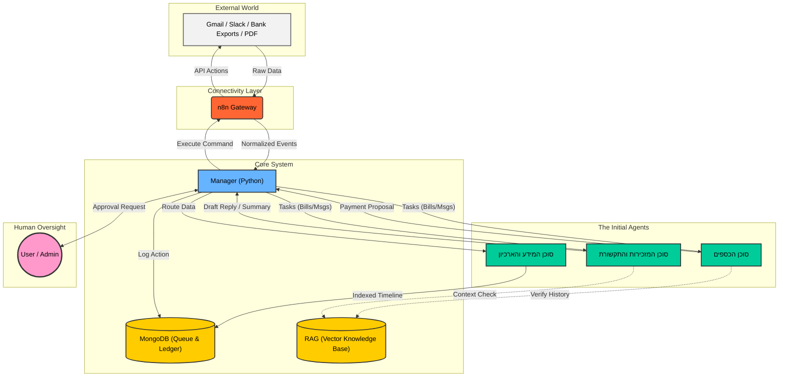
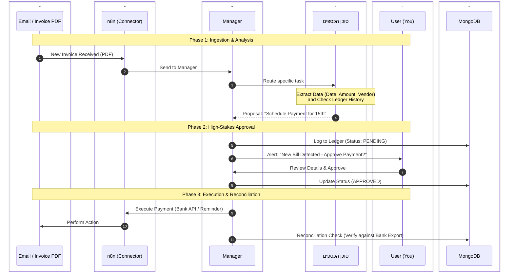

# myOS - ארכיטקטורת המערכת

מסמך זה מתאר את המבנה הפנימי, זרימת המידע והרכיבים של מערכת myOS. הוא נועד להסביר **איך** המערכת עובדת, **מי** עושה מה, **ולמה** נבחרו טכנולוגיות מסוימות.

## 1. תכנון מערכת ברמה הגבוהה (HLD)

הארכיטקטורה עוקבת אחר תבנית של **תזמור ריכוזי (Centralized Orchestration)** עם **אדם בלולאה (Human-in-the-Loop)**.

משתמש הקצה (אתה) מתקשר אך ורק עם המנהל (Manager) דרך ממשק, בעוד המנהל אחראי על הפעלת הסוכנים, שמירת המידע וביצוע הפעולות דרך n8n.

## 2. פירוט הסוכנים הראשונים (The Initial Agents)

המערכת נבנית על בסיס שלושה סוכנים מרכזיים הבונים את "העצמות" של המערכת:

### 2.1. סוכן המידע והארכיון (Information & Archive Agent) - "הבסיס"

סוכן זה מהווה את עמוד השדרה (Backbone) של המערכת כולה.

> [!NOTE]
> **הבהרה חשובה**: זהו **אינו** ה"מנהל" (Manager). סוכן זה פועל כמו "ספרן" או "ארכיונאי" שמסדר את המידע עבור המנהל. בעוד המנהל מקבל החלטות, סוכן המידע רק דואג שהכול יהיה רשום ומסודר.

**תפקיד**: זהו סוכן שירות (Foundation Agent) שאינו מתקשר ישירות עם המשתמש, אלא משרת את שאר הסוכנים.

**מקורות מידע**: מתחבר לכל הערוצים: אימיילים, קבצי PDF, התראות אפליקציה, וייצוא נתונים בנקאיים.

**פעולות מרכזיות**:

**נרמול (Normalizes Data)**: הופך מידע גולמי ומבולגן ממקורות שונים ל"סכמה" אחידה.

**אינדוקס (Indexing)**: בונה ומנהל ציר זמן (Timeline) מסודר ומאונדקס של כל האירועים במערכת.

**למה ראשון?**: כדי לבסס מחברים (Connectors) יציבים ששאר המערכת תוכל לסמוך עליהם.

### 2.2. סוכן הכספים (Finance Agent) - "סיכון גבוה"

סוכן בעדיפות עליונה (P0) המתמודד עם משימות קריטיות ורגישות (High-stakes).

**הבעיה**: מניעת פספוס תשלומים, עומס מנטלי של ניהול חשבוניות וקנסות פיגור.

**פעולות מרכזיות**:

**ספר חשבונות מאוחד (Unified Ledger)**: שאיבת נתונים מכל מקור (SMS, בנק, מייל) וחילוץ: תאריך, סכום, מוטב, ואסמכתא.

**ניהול ותצוגה**: הצגת תמונת מצב שבועית/יומית והתראות על סיכונים.

**אישורים (Approval-based)**: שום תשלום לא מבוצע ללא אישור מפורש מהמשתמש.

**התאמות (Reconciliation)**: וידוא ביצוע התשלום בפועל מול רישומי הבנק.

**למה הוא כאן?**: בונה את מנגנוני הבטיחות, הלוגים והטיפול בשגיאות בצורה המחמירה ביותר במערכת.

### 2.3. סוכן המזכירות והתקשורת (Secretariat & Comms Agent) - "נפח גבוה"

סוכן בעדיפות עליונה (P0) המתמודד עם עומס המידע היומיומי (High-volume).

**הבעיה**: הצפה של הודעות בערוצים מרובים (Email, LinkedIn, WhatsApp, Slack) ובזבוז זמן על מיון.

**פעולות מרכזיות**:

**ריכוז וסיווג**: שאיבת כל ההודעות לתור אחד וסיווגן (עבודה, אישי, פיננסי, דחיפות).

**חילוץ משימות**: זיהוי "שיעורי בית" (Action Items) מתוך הטקסט.

**ניסוח וסיכום**: יצירת תקצירים לשרשורים ארוכים והכנת טיוטות תגובה לאישור (Approval-to-send).

**למה הוא כאן?**: בונה את חווית המשתמש (UX) לניהול תורים וסקירה מהירה, שתשמש גם סוכנים אחרים.

## 3. דיאגרמת רצף (Sequence Diagram) - תרחיש תשלום חשבונית

דוגמה לתהליך של סוכן הכספים, המדגימה את עקרון ה-Human-in-the-Loop וה-Reconciliation:

## 4. תפקידים ואחריות ברכיבי המערכת

### 4.1. המשתמש (אתה)

**תפקיד**: הסמכות העליונה. אתה לא מגדיר **איך** הדברים נעשים, אלא מאשר **מה** ייעשה.

**אינטראקציה**: התקשורת שלך היא מול ה-Manager (המנהל) בלבד.

**תהליך האישור**: ה-Manager יוצר משימה ומבקש אישור. שום סוכן לא פונה אליך ישירות.

### 4.2. שכבת הקישוריות (n8n)

**תפקיד**: "הידיים והעיניים". הרכיב שאחראי על התקשורת הטכנית מול העולם החיצוני (API, Webhooks).

**אחריות**: אימות מול גוגל/בנקים, והעברת מידע נקי (JSON) למנהל.

### 4.3. מנהל הליבה (Manager - Python)

**תפקיד**: "המוח המתכלל".

**אחריות**: ניהול המצב (State), ניתוב משימות לסוכן הנכון, אכיפת מדיניות אבטחה, ותקשורת עם מסד הנתונים.

### 4.4. ה-RAG והזיכרון

**תהליך**: טעינת מסמכים (Ingestion) -> חלוקה (Chunking) -> הטמעה (Embedding) -> ושליפה בעת הצורך (Retrieval) כדי לתת לסוכנים הקשר על העבר.

### 4.5. למה MongoDB?

נבחר בגלל הגמישות (Schema-less) המאפשרת שמירת מבני נתונים משתנים בין סוכנים שונים (למשל: חשבונית מורכבת לעומת הודעת וואטסאפ פשוטה) באותו מסד נתונים ללא צורך בשינוי מבנה קשיח.

