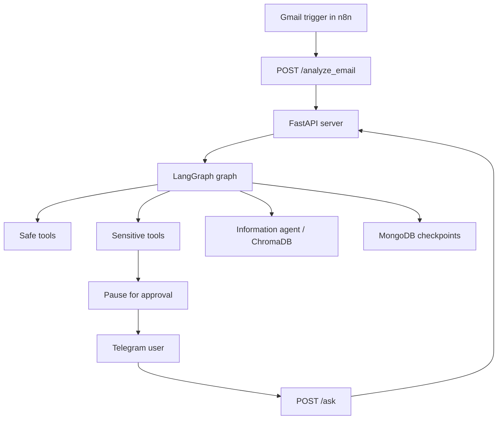

# myOS Architecture

## Purpose

This document describes the current runtime architecture of `myOS` as reflected in the codebase.

## Runtime Components

- `server.py`
  The main FastAPI application. It exposes the public API, initializes LangGraph, and coordinates the approval flow.

- `main.py`
  Starts FastAPI and the native Telegram bot in the same Python process.

- `agents/langgraph_agent.py`
  Builds the LangGraph graph, defines tool access, separates safe tools from sensitive tools, and manages LLM-provider fallback.

- `bot/telegram_bot.py`
  Handles inbound Telegram messages and outbound approval cards with inline buttons.

- `bot/message_formatter.py`
  Normalizes button labels, scopes callback data to a thread, and formats server responses for Telegram safely.

- `utils/gmail_tools_lc.py`
  LangChain tool wrappers around Gmail actions such as search, fetch, draft, send, archive, and trash.

- `utils/calendar_tools_lc.py`
  LangChain tool wrappers around Calendar actions such as availability lookup, event creation, updates, and deletion.

- `agents/information_agent.py`
  Handles long-term memory using ChromaDB and an LLM-backed retrieval flow.

- `core/state_manager.py`
  Persists pending actions, Telegram message mappings, and contact information in MongoDB, with an in-memory fallback.

## High-Level Flow

## Design Principles

- Local-first operation with external LLM calls only where needed
- Human-in-the-loop for state-changing actions
- Tool-based orchestration instead of hardcoded flow branching
- Thread-scoped Telegram approvals to keep user actions aligned with the right workflow
- Public repository hygiene: no checked-in secrets, local databases, or raw personal exports

## Sensitive vs Safe Actions

Examples of safe actions:

- Reading calendar availability
- Fetching recent emails
- Searching memory

Examples of sensitive actions:

- Sending email
- Creating or updating calendar events
- Trashing email

Sensitive actions are expected to stop behind an approval boundary before they execute.
